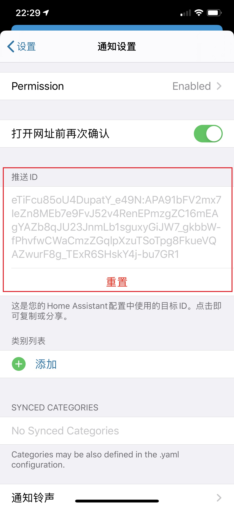

# HomeAssistant手机APP


https://companion.home-assistant.io/

## 在HomeAssistant中的配置

- 基础配置

    ```yaml
    default_config:
    ```

    或者

    ```yaml
    mobile_app:

    discovery:
    ```

- 如果安装IOS下的APP，建议增加配置

    ```yaml
    ios:
    ```


## APP下载

- 苹果IOS

    直接在AppStore中搜索安装`HomeAssistant`

- Android

    + Google Play Store

        https://play.google.com/store/apps/details?id=io.homeassistant.companion.android

    + Github下载

        https://github.com/home-assistant/android/tags

- Android的`full`/`minimal`版本

    - `full`版本包含`minimal`版本的所有功能
    - 手机定位与消息下发功能仅在`full`版本中提供
    - `minimal`版本运行时，不需要Google Play Services

    *从Google Play store仅能下载`full`版本*

## 使用

*手机APP具有浏览器访问的全部功能*

- 连接信息

    适应手机移动的特性，提供外网URL地址与内网URL地址配置

- 传感器

- 手机定位

- 消息下发

    + Android中消息下发是基于Google Play Services的，非科学上网无法使用
    + IOS下需要获得`推送ID`才能使用消息下发功能

        

    + 每天可以下发的消息是300条

- 更多的功能

    + 多媒体消息
    + 消息控制手机
    + 苹果手表动作控制
    + ……
