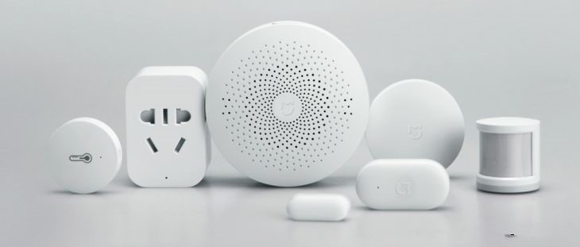
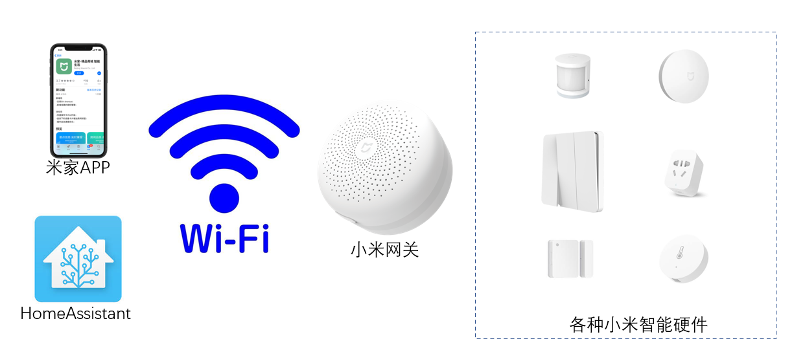
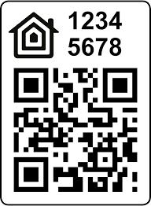

# 接入小米网关

[《HomeAssistant智能家居实战篇》视频](https://study.163.com/course/courseLearn.htm?courseId=1006189053&share=2&shareId=400000000624093#/learn/video?lessonId=1053682912&courseId=1006189053)

## 小米网关与协议

- 小米网关是各种小米智能硬件的通讯中转站

    

- 与小米网关通讯
    + **miio协议**
    + **aqara协议**
    + **homekit协议**

- 模糊性

    + 网关开放哪种通讯协议？小米官方并没有明确的说法

    + 怎么获得miio协议和aqara协议通讯需要的token？只有各种第三方总结的可能会失败的方法

    + 小米官方没有公开具体miio和aqara协议内容

**如果你希望不使用小米网关，直接与小米的zigbee设备通讯，请参见本视频课程的《zigbee设备接入》篇章**

## 集成`HomeKit Controller`

- 官方页面

    https://www.home-assistant.io/integrations/homekit_controller/

- 在前端`配置`-`集成`页面进行配置

## 集成`Xiaomi Miio`

- 官方页面

    https://www.home-assistant.io/integrations/xiaomi_miio/

- 一种通过小米云端获得token的方法

    https://github.com/PiotrMachowski/Xiaomi-cloud-tokens-extractor

- 在前端`配置`-`集成`页面进行配置

## 集成`小米 Aqara 网关`

- 官方页面

    https://www.home-assistant.io/integrations/xiaomi_aqara/

- 一种通过米家APP获得token的方法

- 在前端`配置`-`集成`页面进行配置

