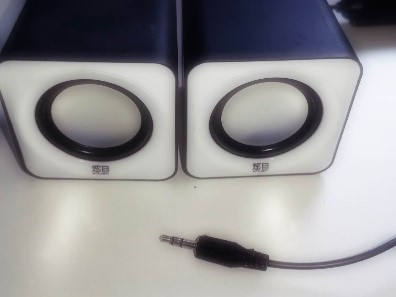

# 自定义组件PulseAudio

[《HomeAssistant智能家居实战篇》视频](https://study.163.com/course/courseLearn.htm?courseId=1006189053&share=2&shareId=400000000624093#/learn/video?lessonId=1053682899&courseId=1006189053)

## Media_player组件

https://www.home-assistant.io/integrations/#media-player

## 下载PulseAudio组件程序

https://github.com/zhujisheng/HAComponent/tree/master/pulseaudio

放置在HomeAssistant的`/config/custom_components/`目录中

## 配置本地声卡输出

- 配置耳机插孔音箱

  

- 既支持前端`集成页面`配置，也支持`configuration.yaml`配置

- 使用服务，播放媒体文件
    + 播放本地声音文件
    + 播放视频文件中的声音
    + 播放网络上的媒体文件

## 连接蓝牙音箱

- 启动Add-on `Terminal & SSH`
- 运行`bluetoothctl`

    ```sh
    scan on
    pair <your mac address>
    trust <your mac address>
    connect <your mac address>
    discoverable on
    pairable on
    default-agent
    exit
    ```

- `pactl`命令

    `pactl list sinks short`
