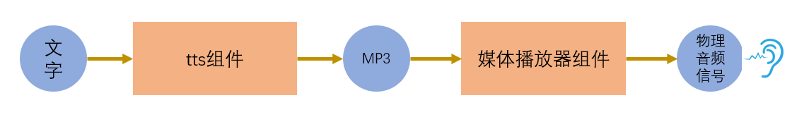

# 朗读文字

[《HomeAssistant智能家居实战篇》视频](https://study.163.com/course/courseLearn.htm?courseId=1006189053&share=2&shareId=400000000624093#/learn/video?lessonId=1053677728&courseId=1006189053)

## TTS(text-to-speech)

- 过程

    

- tts类的组件(集成)

    https://www.home-assistant.io/integrations/#text-to-speech

## Google Translate Text-to-Speech

https://www.home-assistant.io/integrations/google_translate/

- 配置

    ```yaml
    tts:
      - platform: google_translate
        language: 'zh-cn'
    ```

- 国内访问

    修改对`google.com`的访问，改为访问`google.cn`

    ```sh
    mkdir -p /config/custom_components/google_translate

    docker exec -it homeassistant sh -c "cp -r /usr/src/homeassistant/homeassistant/components/google_translate/* /config/custom_components/google_translate"

    sed -i s/'gTTS(text=message, lang=language)'/'gTTS(text=message, lang=language, tld=\"cn\")'/g /config/custom_components/google_translate/tts.py
    ```

    *以上命令使用仓库`Home Assistant Community Add-ons`中的Add-on`SSH & Web Terminal`，非保护模式下工作*

    


## 百度tts

https://www.home-assistant.io/integrations/baidu/

- 申请百度云免费开发者账号

    百度云-语音合成网站：https://cloud.baidu.com/product/speech/tts

- 配置百度tts

    ```yaml
    tts:
      - platform: baidu
        app_id: 9931748 
        api_key: YaEF9KGD6WvoXpvGMZxtX3Qj
        secret_key: 70e71c2425ddccb67439dafdcf9b999f
        speed: 5
        pitch: 5
        volume: 5
        person: 1
    ```

    参数：https://ai.baidu.com/ai-doc/SPEECH/Qk38y8lrl#%E4%B8%8A%E4%BC%A0%E5%8F%82%E6%95%B0

- 调用服务
    + 服务名：tts.baidu_say
    + 参数

        ```yaml
        entity_id: all
        message: 要朗读的文字
        options:
          person: 5118
          speed: 5
          pitch: 5
          volume: 5
        ```
