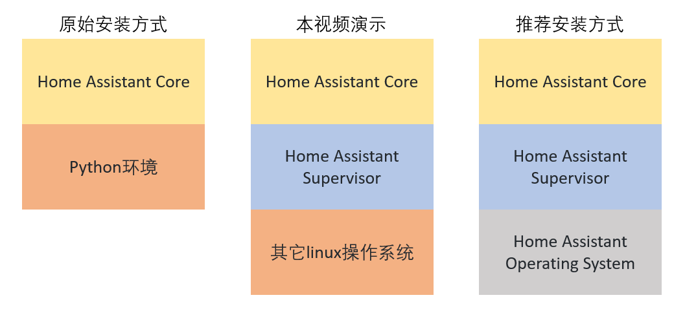

# 非HassOS安装Supervisor(hassio)

[《HomeAssistant智能家居实战篇》视频](https://study.163.com/course/courseLearn.htm?courseId=1006189053&share=2&shareId=400000000624093#/learn/video?lessonId=1282069113&courseId=1006189053)

*注：除了CentOS，官方目前不再提供其它操作系统下直接安装Supervisor的方法。因此，本视频的安装方式已经失效。*

*如果你想在CentOS下安装Supervisor，请参考[官方网站](https://github.com/home-assistant/supervised-installer)中的最新安装方法。*

## 三种安装方式



## 安装依赖软件

- docker

    `curl -fsSL https://get.docker.com -o get-docker.sh`

    `sh get-docker.sh --mirror Aliyun`

- NetworkManager

    - 配置NetworkManage不使用随机MAC

        ```sh
        sudo mkdir -p /etc/NetworkManager/conf.d/
        cat << EOF | sudo tee /etc/NetworkManager/conf.d/100-disable-wifi-mac-randomization.conf
        [connection]
        wifi.mac-address-randomization=1

        [device]
        wifi.scan-rand-mac-address=no
        EOF
        
        ```

    - 安装

        `sudo apt-get install -y network-manager`

    - 停止ModemManager服务

        `sudo systemctl stop ModemManager`

        `sudo systemctl disable ModemManager`

- AppArmor与一些其它的软件包

    `sudo apt-get install -y apparmor-utils jq software-properties-common apt-transport-https avahi-daemon ca-certificates curl dbus socat`

## 配置docker

- 将pi用户加入docker组

    `sudo usermod -aG docker pi`

- 设置docker的日志驱动，以及镜像的国内下载点

    ```sh
    if [ ! -d /etc/docker ];then
       sudo mkdir -p /etc/docker
    fi
    cat << EOF | sudo tee /etc/docker/daemon.json 
    { 
        "log-driver": "journald",
        "registry-mirrors": [ 
        "https://rw21enj1.mirror.aliyuncs.com",
        "https://dockerhub.azk8s.cn",
        "https://reg-mirror.qiniu.com",
        "https://hub-mirror.c.163.com",
        "https://docker.mirrors.ustc.edu.cn"
        ]
    }
    EOF
    sudo systemctl daemon-reload
    sudo systemctl restart docker
    ```

## 安装Supervisor

参考：https://github.com/home-assistant/supervised-installer

- 国内用户

    `raw.githubusercontent.com`的域名解析问题

    通过[https://githubusercontent.com.ipaddress.com/raw.githubusercontent.com](https://githubusercontent.com.ipaddress.com/raw.githubusercontent.com)查询后放入`/etc/hosts`文件中

- 下载安装脚本

    `curl -Lo installer.sh https://raw.githubusercontent.com/home-assistant/supervised-installer/master/installer.sh`

- 安装

    `sudo bash installer.sh --machine raspberrypi4`

    [支持的machine类型](https://github.com/home-assistant/supervised-installer#supported-machine-types)