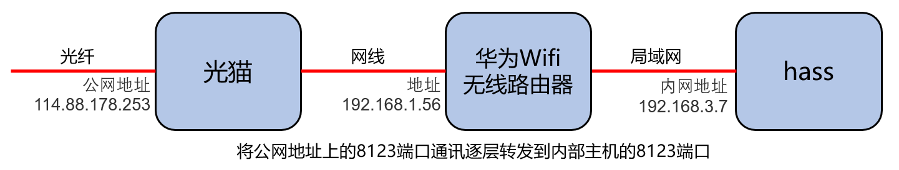

# 使用HASSIO插件配置域名与证书(1)

## 公网访问三大件

- **打通公网访问链路**
- **配置域名**
- 申请与配置网站数字证书

## 基于家庭宽带的公网IP+端口映射实现公网IP访问

- 申请家庭宽带公网IP
- 逐层端口转发

    

## DuckDNS动态域名服务（ddns）的实现

解决公网IP地址不便于记忆，以及公网IP地址在重启上网设备时会变化的问题
