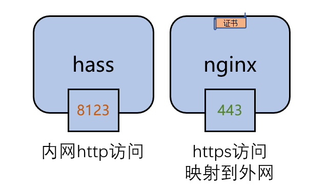

# 使用HASSIO插件配置域名与证书(2)

## 公网访问三大件

- 打通公网访问链路
- 配置域名
- **申请与配置网站数字证书**

## 获得网站数字证书

duckdns插件中证书相关的配置

```yaml
lets_encrypt:
  accept_terms: true
  certfile: fullchain.pem
  keyfile: privkey.pem
……
```

## 将数字证书配置在HomeAssistant中

```yaml
http:
  ssl_certificate: /ssl/fullchain.pem
  ssl_key: /ssl/privkey.pem
```

## nginx SSL Proxy

