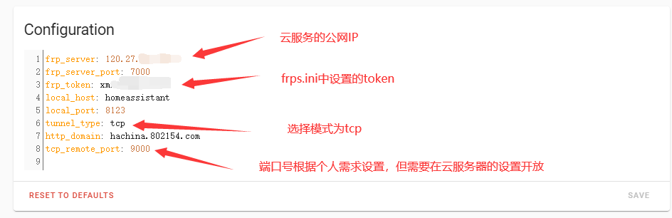

# HASSIO插件——tunnel2local以及frp服务搭建
    
## tunnel2local

- 通过Supervisor添加新的repository，地址为 <https://github.com/zhujisheng/hassio-addons>
- 或者使用HASSOS定制镜像，该镜像默认安装了tunnel2local组件，地址为 <https://www.hachina.io/hassos_hachina_img/>
    

## frp服务搭建

需要以下操作或准备：

- 有固定公网IP的云服务器（视频以阿里云为例）
- 安装0.32.1版本的frp
- 配置frps服务
- 配置frp的自启动
- 开放云服务器的端口（视频以阿里云为例）

frps服务的具体配置frps.ini：
    
    [common]
    bind_port = 7000
    token = a12345678
    #token根据自己的需求设置，首位最好是字母

自启动的具体配置：
    
    [Unit]
    Description=frp-server-auto
    After=network-online.target
    
    [Service]
    Type=simple
    ExecStart=/bin/frps -c /home/frp/frps.ini
    ## 这里和你实际的frps所在的位置相关
    Restart=on-failure
    
    [Install]
    WantedBy=multi-user.target

## tunnel2local与frps的连接

只需要按照下图进行修改

