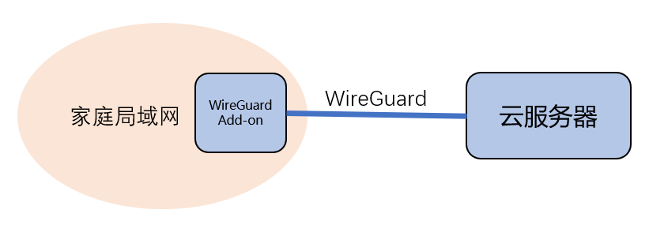
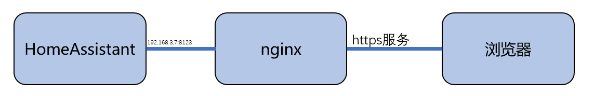

# 使用WireGuard

[《HomeAssistant智能家居实战篇》视频](https://study.163.com/course/courseLearn.htm?courseId=1006189053&share=2&shareId=400000000624093#/learn/video?lessonId=1282111041&courseId=1006189053)

## 构建VPN



#### WireGuard Add-on——本地节点

- 配置内容

    ```yaml
    server:
      host: something_you_like
      addresses:
        - 172.27.66.1
      dns: []

    peers:
      - name: cloudserver
        addresses:
          - 172.27.66.2
        allowed_ips: []
        client_allowed_ips:
          - 172.27.66.1/32
          - 192.168.3.0/24
        endpoint: ec2-54-255-250-235.ap-southeast-1.compute.amazonaws.com:51820
    ```

- 由Add-on发起到远端的VPN连接
    + `peers.endpoint`指定Add-on如何连接远端，修改成你自己的云端服务器
    + `host`用于指定远端如何主动连接此Add-on，在我们的方案中不需要，随便填些什么
    + 可以关闭网络配置中51820端口的映射。
    
- VPN中各端点的IP地址
    + Add-on使用`172.27.66.1`
    + 远端使用`172.27.66.2`
    + 使用的网段不要与各个局域网冲突

- `peers.client_allowed_ips`
    + 远端通过VPN与哪些IP通讯
    + 需要修改成你自己的家庭局域网地址范围
    + 此配置仅用于生成远端的配置文件，本地WireGuard不使用

- 各端使用的密钥
    + 自动生成，你也可以手工生成放入配置文件中
    + 存放在`/ssl/wireguard/`目录下

- 云端服务器的配置文件
    + 会自动生成一个，存放在`/ssl/wireguard/`
    + 需要修改后才能使用

#### 安装与配置WireGuard——远端节点

- 打开防火墙设置
    + UDP 51820
    + TCP 443（用于下面步骤中的网站访问）

- 安装WireGuard

    `sudo apt install wireguard`

    各种操作系统上的安装，参见：https://www.wireguard.com/install/

- 配置文件修改
    + 增加`[Interface]`设置`ListenPort = 51820`
    + 删除`[Peer]`设置`Endpoint`、`PersistentKeepalive`

- 启动

    `wg-quick up 配置文件`

    停止命令：`wg-quick down 配置文件`

- 加入自启动文件

    `/etc/rc.local`


## 在云端配置nginx代理



- 申请域名与数字证书

    + 使用DuckDNS申请

        ```yaml
        lets_encrypt:
          accept_terms: true
          certfile: 证书文件
          keyfile: 私钥文件
        ipv4: 你的公网地址
        ……
        ```
    + 将申请得到的文件保存到云端服务器

- 安装与配置nginx代理
    + 安装

        `sudo apt-get install nginx`

    + 配置文件`/etc/nginx/sites-available/ha_ssl`

        ```
        server {
            listen 443;
            server_name 域名;

            ssl on;
            ssl_certificate 证书文件;
            ssl_certificate_key 私钥文件;
            ssl_prefer_server_ciphers on;

            location / {
                proxy_pass http://HA内网地址:8123;
                proxy_set_header Host $host;
                proxy_http_version 1.1;
                proxy_set_header Upgrade $http_upgrade;
                proxy_set_header Connection "upgrade";
            }
        }
        ```

        `sudo ln -sf /etc/nginx/sites-available/ha_ssl /etc/nginx/sites-enabled/default`

    + 启动或重启

        `sudo nginx`或`sudo nginx -s reload`
