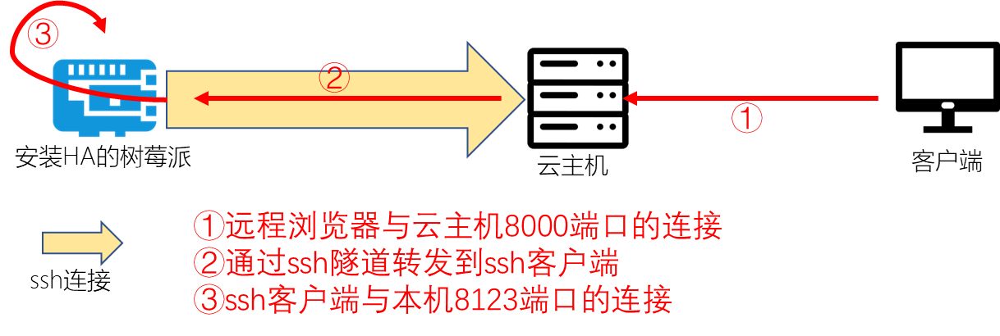

# Pi OS上ssh隧道构建

[《HomeAssistant智能家居实战篇》视频](https://study.163.com/course/courseLearn.htm?courseId=1006189053&share=2&shareId=400000000624093#/learn/video?lessonId=1053678476&courseId=1006189053)

## 操作步骤

1. 在树莓派上使用ssh登录云主机
2. 构建ssh隧道
3. 安装与使用autossh
4. 启动时自动执行autossh命令

## 参考
- 连接示意图

    

- 自启动`/etc/rc.local`添加内容

    `sudo -u pi /usr/bin/autossh -i "/home/pi/etc/amazon_xinjiapo.pem" -R 0.0.0.0:8000:127.0.0.1:8123 ec2-user@ec2-54-251-155-96.ap-southeast-1.compute.amazonaws.com -N -f`
