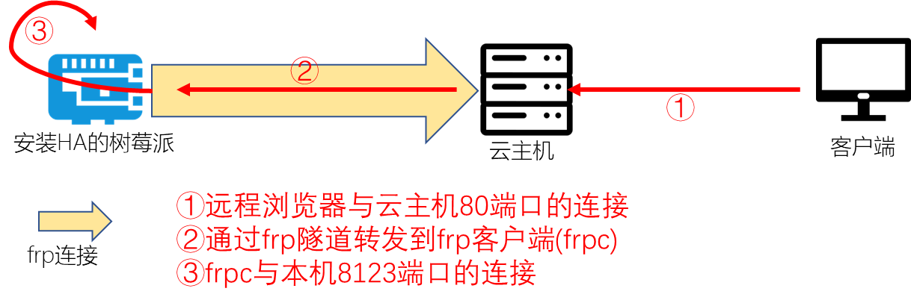

# Pi OS上frp隧道构建

## 操作步骤

1.  打开防火墙规则
2.  在云主机上下载、配置、运行frp服务器端
3.  在树莓派上下载、配置、运行frp客户端
4.  将`frps`和`frpc`命令分别加入云主机与树莓派的启动执行中

## 参考

- 连接示意图

    

- frp软件github地址

    https://github.com/fatedier/frp/

- frp软件下载地址

    https://github.com/fatedier/frp/releases

- frp服务器端配置

    ```ini
    [common]
    bind_port = 7000
    token = a1234
    ```

- frp客户端配置

    ```
    [common]
    server_addr = ec2-54-251-155-96.ap-southeast-1.compute.amazonaws.com
    server_port = 7000
    token = a1234

    [HA]
    type = tcp
    local_ip = 127.0.0.1
    local_port = 8123
    remote_port = 80
    ```

- frp客户端自启动添加内容

    *注：前半部分在等待网络启动后才运行对应命令，其中网关地址需要修改为你实际环境中的地址*

    ```sh
    (
    until ping -nq -c3 192.168.31.1; do
       # Waiting for network
       sleep 5
    done
    /home/pi/frp_0.21.0_linux_arm/frpc -c /home/pi/frp_0.21.0_linux_arm/frpc.ini
    )&
    ```
