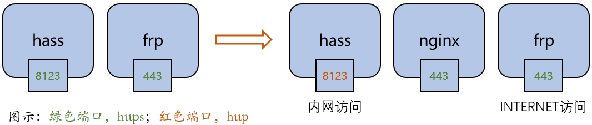

# Pi OS上的nginx代理

[《HomeAssistant智能家居实战篇》视频](https://study.163.com/course/courseLearn.htm?courseId=1006189053&share=2&shareId=400000000624093#/learn/video?lessonId=1278471380&courseId=1006189053)

## 操作步骤

1. 问题与解决方案（为什么要用nginx代理）
2. 安装nginx
3. 修改nginx的配置
4. 修改HA配置
5. 修改frp配置
6. 演示

## 参考

- 示意图

    

- nginx官网

    http://nginx.org/

- 安装nginx

    `sudo apt-get install nginx`

- nginx配置内容

    ```
    server {
        listen 443;
        server_name zjs.duckdns.org;

        ssl on;
        ssl_certificate /etc/letsencrypt/live/zjs.duckdns.org/fullchain.pem;
        ssl_certificate_key /etc/letsencrypt/live/zjs.duckdns.org/privkey.pem;
        ssl_prefer_server_ciphers on;

        location / {
            proxy_pass http://127.0.0.1:8123;
            proxy_set_header Host $host;
            proxy_http_version 1.1;
            proxy_set_header Upgrade $http_upgrade;
            proxy_set_header Connection "upgrade";
        }
    }
    ```

- 修改nginx配置命令

    + 编辑配置文件ha_ssl

        `sudo vi /etc/nginx/sites-available/ha_ssl`

    + 在`sites-enabled`目录下建立配置文件链接

        `sudo ln -sf /etc/nginx/sites-available/ha_ssl /etc/nginx/sites-enabled/default`

    + 重新加载nginx配置

        `sudo nginx -s reload`
