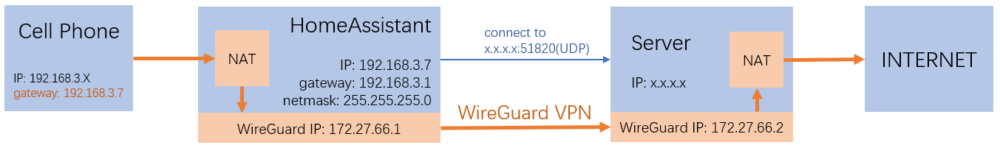
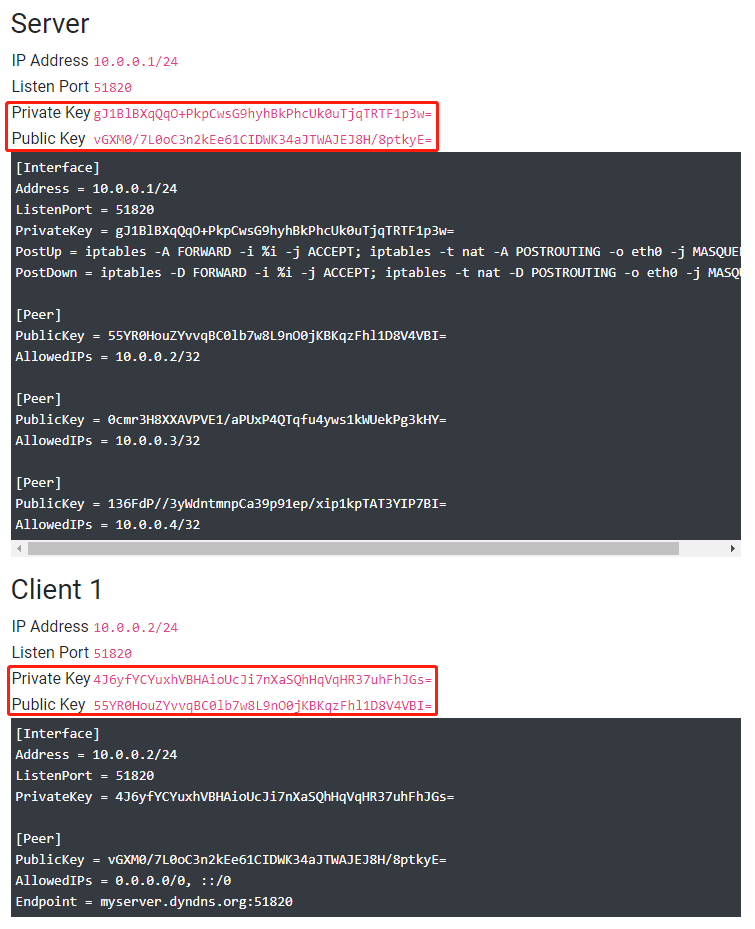

# 网络访问受限解决方案

*“失去的只是锁链，获得的将是整个世界！”*

## 当前表现与最终效果

在中国大陆使用HomeAssistant，会存在以下一些问题：
1. Supervisor中的add-on仓库无缘无故消失
2. 无法使用缺省配置的`tts.google_translate`
3. HACS无法安装
4. HACS中的自定义集成无法安装
5. ……

这些都是由于网络访问受到限制而造成的。

本解决方案，可以使

- HomeAssistant不再受困于网络访问屏蔽
- 为局域网内没有安装wireguard的主机（手机）提供科学上网服务
- 为安装了wireguard的主机（手机）提供科学上网




## 准备工作

1. 一台国外的云主机

    - 推荐使用[hostwinds](https://www.hostwinds.com/)的云主机
    - 建议选择`VPS`/`Unmanaged Linux`，最低端的产品即可（$4.99/月）
    - 建议选择ubuntu操作系统
    - 参考[解决国内无法访问VPS的问题](https://www.vps234.com/hostwinds-ip-blocked-fix-isp/)，获得一台国内可以访问的云主机

2. 树莓派

    - 安装HomeAssistant系统（基于hassos）

## WireGuard的基础知识

- 支持的操作系统

    WireGuard是一个VPN工具，支持常用的电脑操作系统（Windows、Linux、MacOS）与手机操作系统（Android、IOS）

- IP地址

    你需要为每一台安装WireGuard的主机（手机）分配一个私网IP地址，比如`172.27.66.x`。

    每台主机（手机）分配的IP地址不能相同，但属于同一个子网

- 公私钥对

    你需要为每一台安装WireGuard的主机（手机）设定一个公私钥对

    本机的私钥配置在本机上，本机的公钥配置在需要通讯的对端

- 公私钥对生成

    + 最简单的方法，是直接到网站[https://www.wireguardconfig.com/](https://www.wireguardconfig.com/)随机生成。

        点击其中`Generate Config`按钮，拷贝生成的`Private Key`和`Public Key`使用。

        

    + 在安装了WireGuard的linux中，你也可以使用命令`wg genkey | tee privatekey | wg pubkey > publickey`，随机生成包含公私钥的文件`publickey`和`privatekey`

    + 在有图形界面的wireguard中（手机端、Windows），也可以随意生成公私钥对供使用


## 后续配置样例中的一些约定

- VPN使用的子网为`172.27.66.0/24`
- HomeAssistant中wireguard add-on

    + 私钥：`qKywOoIV0zk24kOLvc3LSYWtNsBVnGK33KwnRQph928=`
    + 对应公钥：`w3Z4nyRk7GU4pifBlVZ0tQSG8L5HOZtR72cgqIl3fjU=`
    + IP地址：`172.27.66.1`

- 云主机

    + 私钥：`KLgzNLn3HWU162rcWkwWuxe2bTSbMjeiF59cG+3ls0A=`
    + 对应公钥：`0JVKWfyYylbEEwcRIVxgR1KoHEDKWHY97UQUjhRPc0E=`
    + IP地址：`172.27.66.2`

- 其它安装wireguard的主机（手机）

    + 私钥：`wMwS6lwcI/YM8ctO7g/0gbsNEAr2EPifGNbfdYGrkkI=`
    + 对应公钥：`tyoNPY0U/AvcSbJTaB4RAbyfKcXaXBTfmiNbV3NvCz8=`
    + IP地址：`172.27.66.3`

    *如果有多台主机（手机），就生成多个配置，每个配置使用不同的IP地址与公私钥对*

注：你可以修改VPN使用的子网为其它的私网地址，对应修改以下配置中`172.27.66`开头的地址即可。但注意VPN使用的子网，不可与你的局域网地址相同。

## 云主机端安装与配置

- 安装

    `apt-get install wireguard`

- 打开IP Forward选项

    查看`cat /proc/sys/net/ipv4/ip_forward`，如果为`0`，需要进行以下操作

    + 编辑文件`/etc/sysctl.conf`

    + 修改其中`net.ipv4.ip_forward = 1`，去除前面的注释符

    + 运行`sysctl -p`

- WireGuared配置文件

    配置文件保存在`/etc/wireguard/wg0.conf`中，内容如下：

    ```conf
    [Interface]
    PrivateKey = KLgzNLn3HWU162rcWkwWuxe2bTSbMjeiF59cG+3ls0A=
    Address = 172.27.66.2/24
    ListenPort = 51820
    PostUp = iptables -A FORWARD -i %i -j ACCEPT; iptables -A FORWARD -o %i -j ACCEPT; iptables -t nat -I POSTROUTING -s 172.27.66.0/24 -j MASQUERADE; iptables -t nat -p udp -I PREROUTING -m multiport --dport 1025:10000 -j REDIRECT --to-ports 51820
    PostDown = iptables -D FORWARD -i %i -j ACCEPT; iptables -D FORWARD -o %i -j ACCEPT; iptables -t nat -D POSTROUTING -s 172.27.66.0/24 -j MASQUERADE; iptables -t nat -p udp -D PREROUTING -m multiport --dport 1025:10000 -j REDIRECT --to-ports 51820

    [Peer]
    PublicKey = w3Z4nyRk7GU4pifBlVZ0tQSG8L5HOZtR72cgqIl3fjU=
    AllowedIPs = 172.27.66.1/32

    [Peer]
    PublicKey = tyoNPY0U/AvcSbJTaB4RAbyfKcXaXBTfmiNbV3NvCz8=
    AllowedIPs = 172.27.66.3/32
    ```

    注：

    - 有多少台设备直接连接云服务器科学上网，就配置多少个`[peer]`，每个`[peer]`中的配置内容对应不同的`N`
    - 为了安全，请使用你自己生成的公私钥替换以上配置中的公私钥
    - wireguard中对外开放UDP端口`51820`与`1025`-`10000`(`1025`-`10000`由规则`iptables -t nat -p udp -I PREROUTING -m multiport --dport 1025:10000 -j REDIRECT --to-ports 51820`实现)，客户端可以连接其中任意一个端口（功能相同）。

        之所以实现这么多端口，是因为一个端口使用时间长后，有可能被封——这时候，在客户端换个端口连接即可。

        如果是amazon云主机，需要在防火墙规则中打开对应端口的对外通讯（hostwinds云主机缺省无防火墙）

- 启动与停止

    启动命令：`wg-quick up wg0`

    停止命令：`wg-quick down wg0`

- 自启动

    参见[Ubuntu 20.04 手动实现 rc.local](https://blog.csdn.net/lk_luck/article/details/108361857)，将上面的启动命令加入到`/etc/rc.local`中

## HomeAssistant中add-on `Raw WireGuard`的安装与配置

- 安装add-on `Raw Wireguard`

    前端在`supervisor`/`add-on商店`中，增加仓库(Repo):`https://github.com/zhujisheng/hassio-addons`

    安装该仓库中的add-on：`Raw WireGuard`

- 配置add-on WireGuard

    ```yaml
    interface:
      PrivateKey: qKywOoIV0zk24kOLvc3LSYWtNsBVnGK33KwnRQph928=
      Address: 172.27.66.1/24
      PostUp: >-
        iptables -A FORWARD -i %i -j ACCEPT; iptables -A FORWARD -o %i -j ACCEPT;
        iptables -t nat -A POSTROUTING -o %i -j MASQUERADE
      PostDown: >-
        iptables -D FORWARD -i %i -j ACCEPT; iptables -D FORWARD -o %i -j ACCEPT;
        iptables -t nat -D POSTROUTING -o %i -j MASQUERADE
    peers:
      - PublicKey: 0JVKWfyYylbEEwcRIVxgR1KoHEDKWHY97UQUjhRPc0E=
        EndPoint: 'x.x.x.x:51820'
        PersistentKeepalive: 25
        AllowedIPs: 0.0.0.0/0
    ```

    注：

    - 需要修改以上配置中云主机的IP地址，也就是配置中出现的`x.x.x.x`
    - 为了安全，请使用你自己生成的公私钥替换以上配置中的公私钥
    - 大陆对有些域名（比如raw.githubusercontent.com）存在域名污染，但在Raw Wireguard add-on中设置的DNS仅对该add-on有效。可以在ssh add-on中运行命令`ha dns options --servers dns://8.8.8.8`修改域名服务器，设置后对所有add-on（包括HomeAssistant Core）有效。

- 启动与使用

    - add-on默认未设置自启动，请在完善测试后再设置，防止系统永远无法访问
    - **局域网中的其它机器，保持原有IP地址，将网关设置为HomeAssistant的IP地址，即可科学上网**

## 在其它主机（手机）上配置wireguard

- linux

    按照前述方法安装与启动。

    配置如下
    ```conf
    [Interface]
    PrivateKey = wMwS6lwcI/YM8ctO7g/0gbsNEAr2EPifGNbfdYGrkkI=
    Address = 172.27.66.3/24
    DNS = 8.8.8.8

    [Peer]
    PublicKey = 0JVKWfyYylbEEwcRIVxgR1KoHEDKWHY97UQUjhRPc0E=
    AllowedIPs = 0.0.0.0/0
    Endpoint = x.x.x.x:51820
    PersistentKeepalive = 25
    ```

    注：需要修改配置中的`x.x.x.x`（云服务器IP）；为了安全，请自己生成公私钥密钥对

- 其它

    无外乎以上这些配置项，在界面中填入。使用不同的`N`即可

## 从Internet访问HomeAssistant

参见前面的课程，在云主机上安装Nginx，代理到`172.27.66.1`的`8123`端口即可。