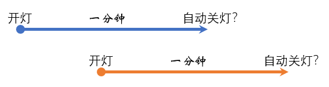
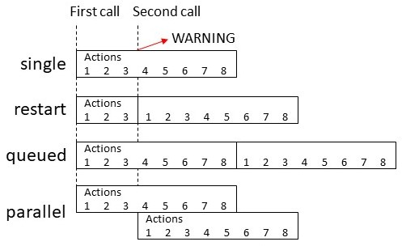

# 自动化基础

## 触发-条件-动作

- 一个样例：在白天，如果小米灯被关闭，就用语音播报一下

    + 触发（trigger）  ： 小米网关灯状态从开变成关
    + 条件（condition）： 日出后，日落前
    + 动作（action）   ： 播报“小米灯被关闭了”

- 手工触发，会忽略规则中的“条件”，直接执行“动作”

- 区分清楚触发与条件

    + 触发，对应的是一个或多个时间点（时刻）
        * 太阳升起的瞬间
        * 灯被打开的瞬间
        * 每隔一个小时
        * 我回到家的瞬间
        * ……
    + 条件，对应的是一个时间段
        * 日出后到午夜
        * 灯是开着的时候
        * 在9点到10点之间
        * 我正在家中的时候
        * ……

## 自动化模式

- 一个样例：小米灯被打开后一分钟，自动关闭

    + 触发（trigger）  ： 小米网关灯状态从关到开
    + 条件（condition）： 无
    + 动作（action）   ： 
        + 延迟一分钟
        + 调用关灯服务

    

- 模式
    + 单点（single）
    + 重启（restart）
    + 队列（queued）
    + 并行（parallel）

    

## yaml编辑自动化

- 前端页面中
- 文件`/config/automations.yaml`

## 快捷自动化创建工具

- 自然语言创建自动化
- Blueprint

## HomeAssistant之外的自动化

- NodeRed
- Homekit
- AppDeamon
- ESPHome
- ......

