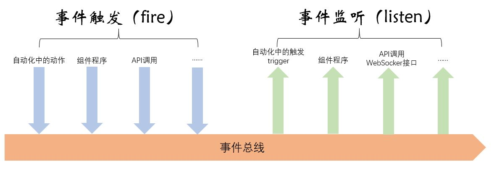

# 自动化机制中的事件（Event）

[《HomeAssistant智能家居实战篇》视频](https://study.163.com/course/courseLearn.htm?courseId=1006189053&share=2&shareId=400000000624093#/learn/video?lessonId=1282205017&courseId=1006189053)

## 事件机制

##### 事件类型

- 每条事件，都对应于某种事件类型
- 事件类型只要求是字符串
- homeassistant中由系统触发的标准类型事件
    + `state_changed`
    + `service_registered`
    + `call_service`
    + ……

##### 事件数据

每条事件中，可以包含该事件相关的信息，称为事件数据。

## 事件工作台

- 左上部：事件手工触发
- 右上部：当前系统中正在被监听的事件
- 下部：事件监听器

    *输入星号（\*）监听所有事件*

## 自动化中的事件

- 可以监听某种事件，用于触发自动化
- 可以在自动化动作中，生成事件

**有一些开关型传感器，比如小米的无线按钮和无线开关，更适合用事件，而不是状态改变，去触发相应的自动化**
