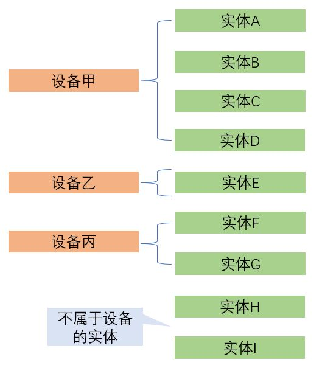

# 自动化机制中的设备与场景

## 设备

**设备是在HomeAssistant后期版本，为了方便用户而引入的概念，它并不是必须的**

组件开发者可以以设备为对象，定义它在自动化的触发、条件和动作三者中对应的逻辑。

例：人体感应器的电池电量小于10%时，就打开小米网关灯。

## 场景

例：场景“日常”，调整灯光与音量

场景的激活：

- 服务`scene.turn_on`
- 自动化动作中`scene`动作

**场景没有"关闭"动作，只能开启另一个的场景**

