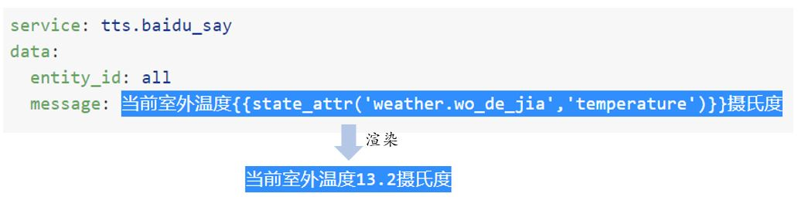

# 模板(Template)

[《HomeAssistant智能家居实战篇》视频](https://study.163.com/course/courseLearn.htm?courseId=1006189053&share=2&shareId=400000000624093#/learn/video?lessonId=1282331042&courseId=1006189053)

## 什么是模板

- 样例一：一段文字

    ```jinja2
    下一次太阳的升起（降落）时间：
    
    太阳下山时间： {{ as_timestamp(strptime(state_attr("sun.sun", "next_setting"), "")) | timestamp_local }}
    
    太阳升起时间： {{ as_timestamp(strptime(state_attr("sun.sun", "next_rising"), "")) | timestamp_local }}
    
    ```

    渲染结果

    ```text
    下一次太阳的升起（降落）时间：
    太阳下山时间： 2021-02-01 17:28:29
    ```

- 样例二：脚本中的服务数据

    ```yaml
    service: tts.baidu_say
    data:
      entity_id: all
      message: 当前室外温度{{state_attr('weather.wo_de_jia','temperature')}}摄氏度
    ```

    

- 模板：指包含代码的文本，当文本被实际使用时，代码执行获得最终的文本（渲染）
- 模板是构建动态内容网站的一种常用技术

- HomeAssistant使用[Jinja2模板引擎](https://jinja.palletsprojects.com/en/master/templates/)

- HomeAssistant对Jinja2模板引擎进行了一些[扩展](https://www.home-assistant.io/docs/configuration/templating/#home-assistant-template-extensions)

## 应用场合

- 自动化
    + 触发中的template类型
    + 条件中的template类型
    + 动作（脚本）中的service和data
    + ……
- 某些组件的配置中
    + [CommandLine Sensor](https://www.home-assistant.io/integrations/sensor.command_line/)
    + [Rest Sensor](https://www.home-assistant.io/integrations/rest/)
    + [MQTT](https://www.home-assistant.io/integrations/#search/mqtt)
    + ……

**注：并不是任意配置内容都能用template**

## 自动化中的`trigger`变量

触发条件为状态变化时：
- `trigger.from_state` 触发之前实体的状态值
- `trigger.to_state` 触发后实体的状态值
- `states[trigger.to_state.entity_id]` 当前实体的状态值

样例：灯的状态变化时，前端显示一条通知消息

```yaml
service: notify.persistent_notification
data:
  message: '{{trigger.entity_id}}由{{trigger.from_state.state}}变为{{trigger.to_state.state}}'
```

不同触发条件启动的自动化规则，`trigger`变量会有不同的结构，详见https://www.home-assistant.io/docs/automation/templating/#available-trigger-data

如果是手工触发或者通过服务触发，`trigger`变量不存在。


