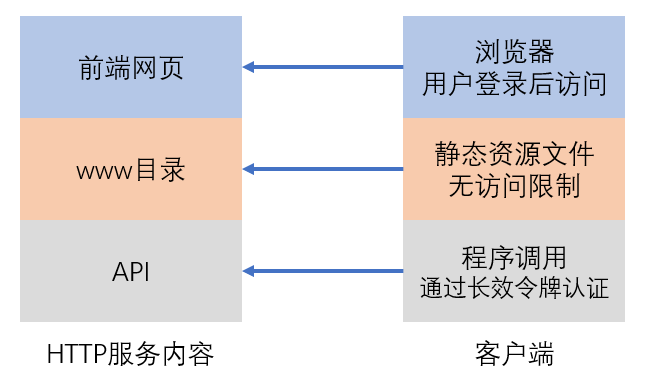
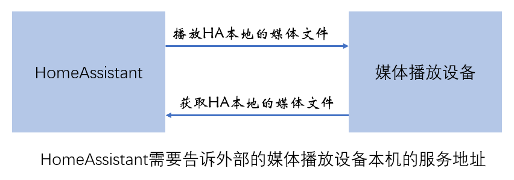

# HTTP服务-WWW目录与API调用



## www服务目录

- `/config/www/`目录中的内容，会在`http://ip:8123/local/`中对外提供服务

- 首次建立www目录后，需要重启HomeAssistant

- 仅能提供静态内容

- 不需要登录即可访问

- 典型应用：lovelace中自定义卡片的资源文件

## API调用

*调用API的程序，通过提供长效令牌，获得与HomeAssistant通讯的资格*

- [REST API](https://developers.home-assistant.io/docs/api/rest)

    python程序样例：调用服务`tts.google_translate_say`播放声音

    ```python
    from requests import post

    url = "http://IP_ADDRESS:8123/api/services/tts/google_translate_say"
    headers = {
        "Authorization": "Bearer TOKENTOKEN",
        "content-type": "application/json",
    }
    data = { "entity_id": "all",
             "message": "你正在通过API调用服务"
           }
    response = post(url, headers=headers, json=data)
    print(response.text)
    ```

- [WebSocket API](https://developers.home-assistant.io/docs/api/websocket)

    WebSocket建立长连接，可以收到即时消息

    [样例：即时获得系统中所有状态变化](programs/websocket_test.py)


## 两个问题

1. 为什么与HomeAssistant互动的平台中不需要配置长效令牌？

    - ESPHome
    - Homekit
    - NodeRed
    - AppDaemon

2. 为什么会有`external_url`与`internal_url`配置

    