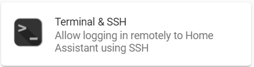
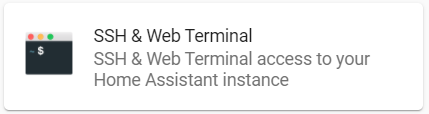
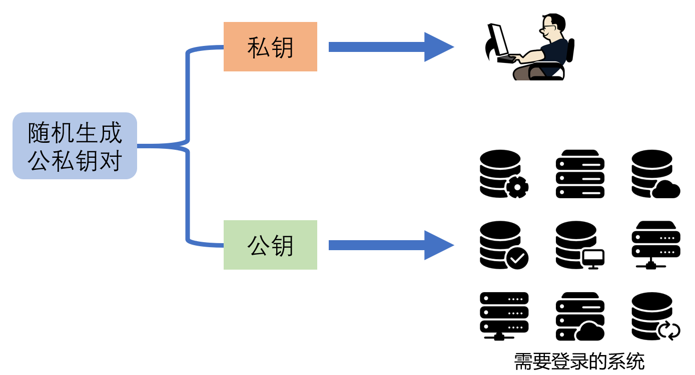

# ssh Add-on的使用

`SSH&WebTerminal`是`Terminal&SSH`的增强版

- 其中安装了更多的工具软件
- 支持`sftp`
- 可以设置非`root`用户登录
- `Protection mode`提供更多的操作指令
- ……

## 开启与登录

- 需要在用户设置中打开`高级模式`才能看到

- 启动安全检查

    如果开启了22号端口映射，则必须设置密码或密钥

    在`SSH&WebTerminal`中设置的密码必须是一个足够强的密码

- 操作台
    + 插件提供了web界面（无需端口映射，无认证过程）
    + ssh客户端软件（需打开端口映射，需密码或密钥认证）

#### 使用密钥对登录ssh

- 生成密钥对

    https://developers.home-assistant.io/docs/operating-system/debugging/#generating-ssh-keys

    `PuTTYgen`下载地址：https://www.chiark.greenend.org.uk/~sgtatham/putty/latest.html

- 使用生成的密钥

## 命令行操作

- `pactl`命令
- `bluetoothctl`命令

- 映射了Add-on和HomeAssistant core常用的几个目录
    + `addons`
    + `backup`
    + `config`
    + `media`
    + `share`
    + `ssl`

- `apk`软件包管理

    https://pkgs.alpinelinux.org/packages

**重启add-on，docker容器重新生成，一切归为原始**
