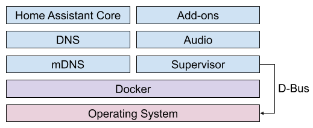

# ha命令与docker命令

[《HomeAssistant智能家居实战篇》视频](https://study.163.com/course/courseLearn.htm?courseId=1006189053&share=2&shareId=400000000624093#/learn/video?lessonId=1282128004&courseId=1006189053)

## Hass CLI（Home Assistant Command Line Interface）

- 提供Supervisor功能的命令行交互管理方式

- 可以在ssh add-on中调用命令

- 官网：https://github.com/home-assistant/cli/

- 比前端界面中的supervisor菜单功能更完善

- supervisor的技术实现架构

    

    一切都是docker

## docker命令

参考：https://docs.docker.com/engine/reference/commandline/cli/

`docker ps`

`docker inspect xxxx`

`docker exec -it xxxx bash`

## add-on`Portainer`

docker的图形化界面管理