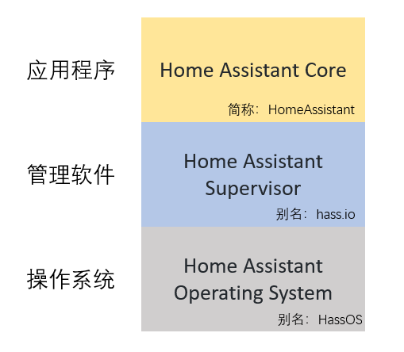

# 管理HassOS操作系统

[《HomeAssistant智能家居实战篇》视频](https://study.163.com/course/courseLearn.htm?courseId=1006189053&share=2&shareId=400000000624093#/learn/video?lessonId=1282132003&courseId=1006189053)

## 前端supervisor界面

- 主机名
- 网络
- 硬件设备（查看）
- 重启/关机/升级
- 操作配置文件导入

## 导入配置文件

- 可导入的文件

    + `network/`

        [配置网络](https://github.com/home-assistant/operating-system/blob/dev/Documentation/network.md)

    + `authorized_keys`

        ssh登录HassOS的公钥

    + `timesyncd.conf`

        配置NTP服务

    + `hassos-*.raucb`

        操作系统升级包，下载：https://github.com/home-assistant/hassos/releases/

    + `modules/`
    + `modprobe/`
    + `udev/`

- 导入方法

    + 在系统盘的`boot`分区，创建一个`CONFIG`目录，在其中放置配置文件，重启

    + 将U盘命名为`CONFIG`，在其中放置配置文件，插入树莓派：直接重启，或在前端页面中导入

#### 演示：升级操作系统

## ssh到HassOS

- 服务端口号：`22222`

- HassOS不提供密码认证方式，仅可使用密钥对的认证方式

#### 演示：ssh到HassOS

https://developers.home-assistant.io/docs/operating-system/debugging/

1. 生成密钥对

    `PuTTYgen`下载地址：https://www.chiark.greenend.org.uk/~sgtatham/putty/latest.html

2. 将公钥文件导入HassOS系统

3. 使用私钥登录系统

#### HassOS系统

- 缺乏一些常用的工具

    `apt`、`apk`、`wget`、`python`、`nano`、……
- 没有时区的概念
- 仅`root`一个可登录用户
- 提供了ha命令行操作工具
- 可以使用docker命令
- 一些常用信息与配置
    + 主机名：`/etc/hostname`
    + 操作系统信息：`/etc/os-release`
    + 网络配置：`/etc/NetworkManager/system-connections/`
    + NTP配置：`/etc/systemd/timesyncd.conf`
- 6个在HomeAssistant core与add-on中经常用到的目录

    - `/config` `/mnt/data/supervisor/homeassistant` 

    - `/media` `/mnt/data/supervisor/media`

    - `/share` `/mnt/data/supervisor/share`

    - `/ssl` `/mnt/data/supervisor/ssl`

    - `/backup` `/mnt/data/supervisor/backup`

    - `/addons` `/mnt/data/supervisor/addons/local`

