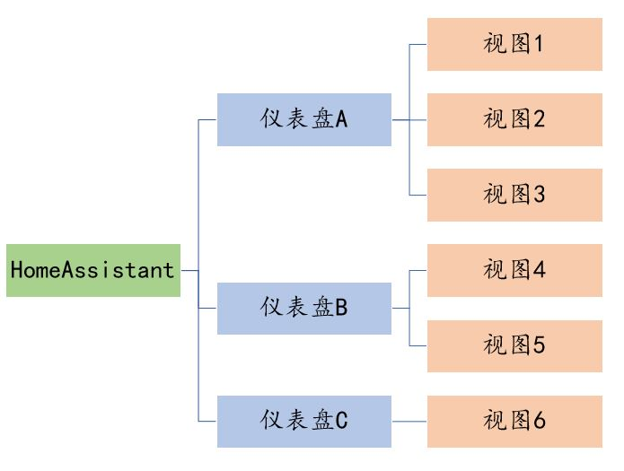

# Lovelace中的基本概念

展示：https://demo.home-assistant.io/

## 仪表盘(Dashboard)

- 可以创建多个仪表盘
- 有一个仪表盘是默认的，也就是网站的首页
- 仪表盘可以“隐藏”，可以“仅管理员可见”
- Lovelace定义仪表盘显示的内容与形式

    **新增加的实体，不会在已经定义了Lovelace的仪表盘中自动出现**

## 视图(View)

- 一个仪表盘中可以包含一个或多个视图

    

- 每个视图中可定义内容
    + 显示内容
        * 标题（Title）
        * 图标（Icon）
        * 徽章（Badges）
        * 卡片（Cards）
    + 属性
        * 网址（Path）
        * 主题（Theme）
        * 面板模式（Panel Mode）
        * 哪些用户可见

#### 主题（Theme）

- 下载一些主题风格

    ```sh
    mkdir /config/themes
    cd /config/themes/
    git clone https://github.com/maartenpaauw/home-assistant-community-themes.git
    ```
- 将主题风格导入HA

    ```yaml
    frontend:
      themes: !include_dir_merge_named themes
    ```

#### 过滤型徽章（FILTER BADGE）

https://www.home-assistant.io/lovelace/badges/#entity-filter-badge

样例：

```yaml
- type: entity-filter
  entities:
    - entity: light.xiaomi_gateway_light
  state_filter:
    - 'on'
```

#### 配置文件

- 存放在`/config/.storage/`文件夹中，以`lovelace`开头的文件
- 文件`lovelace_dashboards`中是仪表盘整体的配置：一共有多少个仪表盘、分别是哪些
- 文件`lovelace`文件是仪表盘"概览"的定义
- 可以删除某个仪表盘的lovelace定义文件，恢复这个仪表盘的初始状态

#### 面板模式与卡片

下个视频，精彩继续！