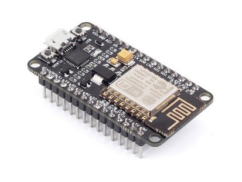
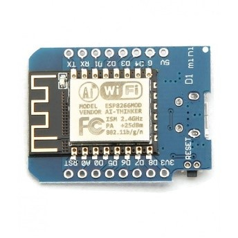
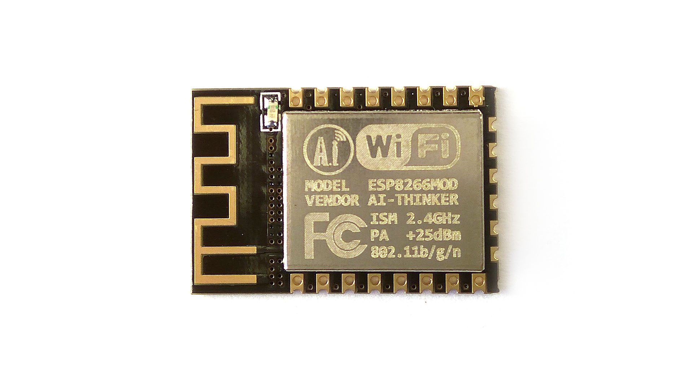
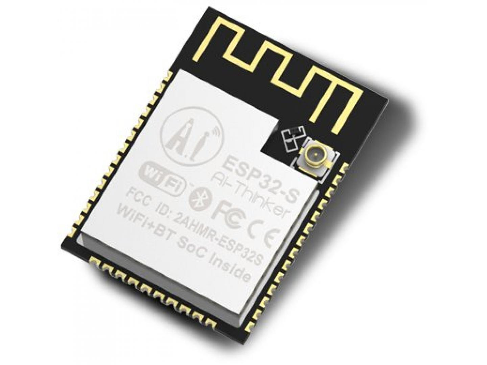
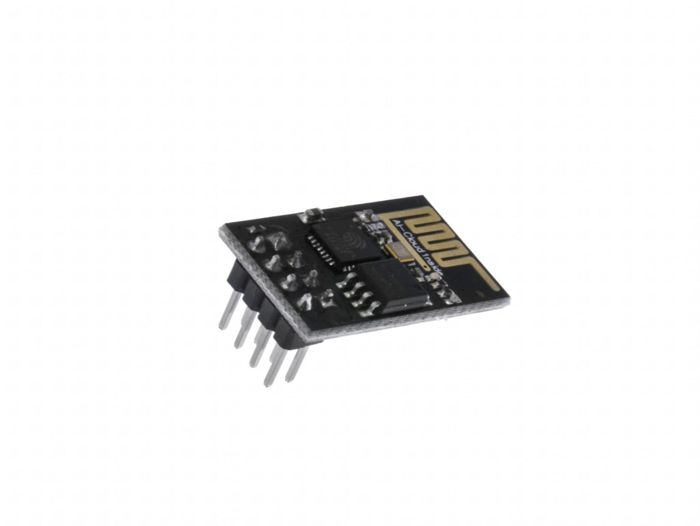
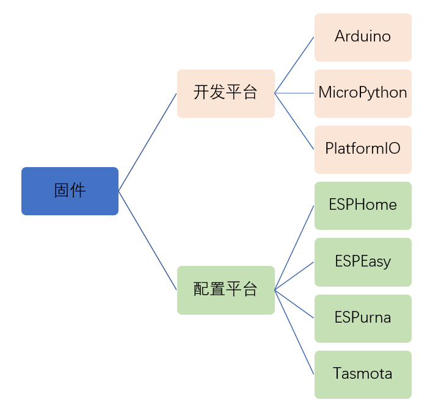
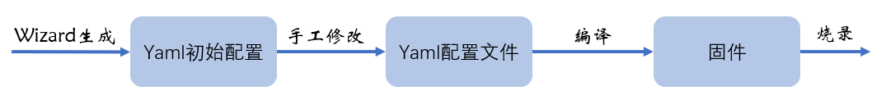
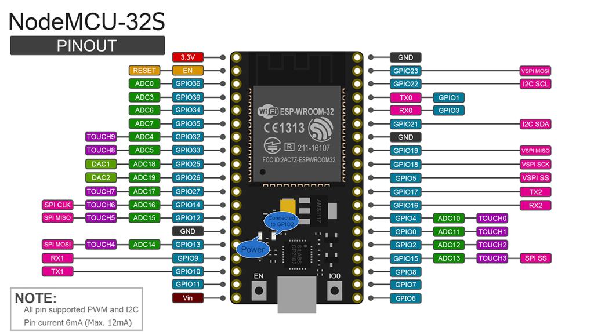

# ESPHome基础

## 硬件基本概念

- 芯片（esp8266、esp32）

    


- 开发板

    

- 模组

    

## 固件



## ESPHome基本流程




## 演示：点亮开发板上的LED灯

- 开发板：nodemcu 32s

    

    

- 操作步骤

    1. 安装并启动Add-on：ESPHome
    2. 通过Wizard创建初始配置
    3. 修改初始配置，增加LED灯

        ```yaml
        light:
          - platform: binary
            name: "LED On NodeMCU Board"
            output: my_led

        output:
          - platform: gpio
            pin: GPIO2
            id: my_led
        ```

    4. UPLOAD

        **第一次烧写程序只能通过串口进行**

        **如果没有显示串口，需要将开发板插入树莓派的USB口后，重新启动一下Add-on:ESPHome**

        **在有些开发板上，在编译完成后，上传会阻塞，这时候需要按板上的`IO0`按钮**

        **上传固件后，如果使用树莓派的USB口供电，可能因为电源不足而无法启动ESP32；可以连接其它的USB充电器供电**

    5. 在HomeAssistant的集成配置中增加ESPHome
