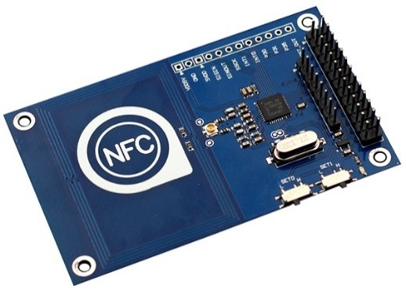
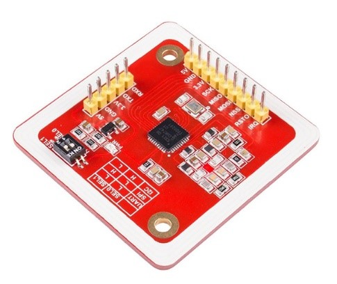
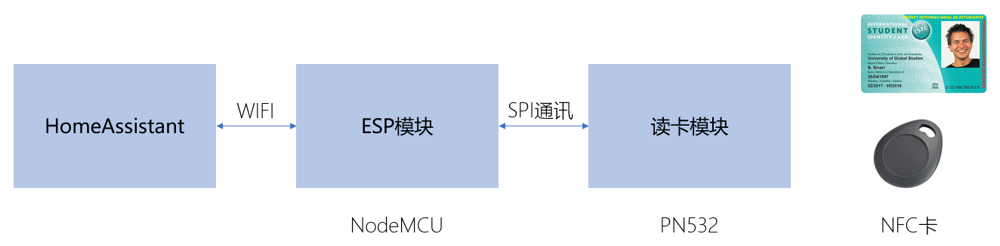
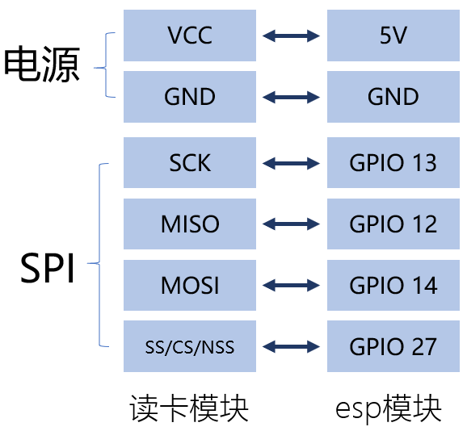

# 使用NFC识别不同的ID卡

[《HomeAssistant智能家居实战篇》视频](https://study.163.com/course/courseLearn.htm?courseId=1006189053&share=2&shareId=400000000624093#/learn/video?lessonId=1282185094&courseId=1006189053)

## 硬件准备

- esp8266模块或者esp32模块（多选一，推荐使用esp32模块）

    

- PN532读卡模块（多选一）

    

## 操作步骤

1. 逻辑结构说明

    

2. 物理连接

    

3. 生成esphome缺省配置

4. 配置PN532并读取卡片信息

    ```yaml
    spi:
      clk_pin: GPIO13
      miso_pin: GPIO12
      mosi_pin: GPIO14

    pn532:
      cs_pin: GPIO27
      update_interval: 1s
    ```

5. 配置具体卡片的开关型传感器

    ```
    binary_sensor:
      - platform: pn532
        uid: F9-37-0A-6E
        name: "Andrew"
      - platform: pn532
        uid: 27-54-21-35
        name: "Bob"
    ```

6. 接入HomeAssistant

7. 配置一个简单的自动化

## 参考

- ESPHome中PN532的配置

    https://esphome.io/components/binary_sensor/pn532.html
