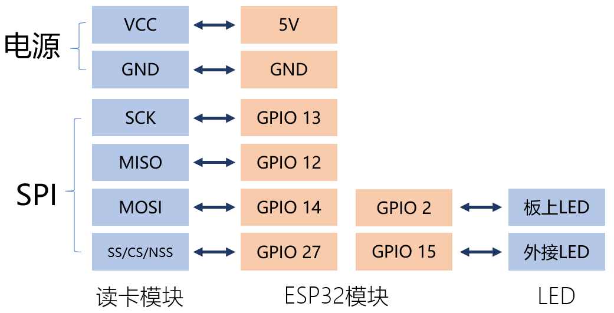

# ESPHome中的自动化基础

## 硬件准备

- 与《使用NFC识别不同的ID卡》相同

## 操作步骤

1. 连接与基础硬件配置

  

2. 增加本地自动化规则

  - 当有nfc卡靠近读卡器时，板上的LED灯就闪烁；

  - 当特定的NFC卡靠近读卡器时，外接的LED灯就点亮；离开时就熄灭。

3. ESPHome中自动化的优势与完全本地运行

## 参考

- 相关视频课程

  + 本篇章其它视频
  + 《音乐灯带》篇章
  + 《智能音箱》篇章中远程麦克风
  + 《DIY红外与433转发设备》篇章
  + 其它以ESPHome开头的视频课程

- ESPHome中的自动化

  https://esphome.io/guides/automations.html

- ESPHome配置

  ```
  esphome:
    name: esp32_nfc
    platform: ESP32
    board: esp-wrover-kit

  wifi:
    ssid: "YourWifi"
    password: "YourPassword"

  # Enable logging
  logger:

  # Enable Home Assistant API
  api:
    password: "hachina"

  ota:
    password: "hachina"

  spi:
    clk_pin: GPIO13
    miso_pin: GPIO12
    mosi_pin: GPIO14

  pn532:
    cs_pin: GPIO27
    update_interval: 1s
    on_tag:
      then:
        - light.toggle: gpio2_led

  binary_sensor:
    - platform: pn532
      uid: F9-37-0A-6E
      name: "Andrew"
      on_press:
        then:
          - light.turn_on: gpio15_led
      on_release:
        then:
          - light.turn_off: gpio15_led

  output:
    - platform: gpio
      pin: GPIO2
      id: gpio2
    - platform: gpio
      pin: GPIO15
      id: gpio15

  light:
    - platform: binary
      id: gpio2_led
      name: "GPIO2_LED"
      output: gpio2
    - platform: binary
      id: gpio15_led
      name: "GPIO15_LED"
      output: gpio15
  ```