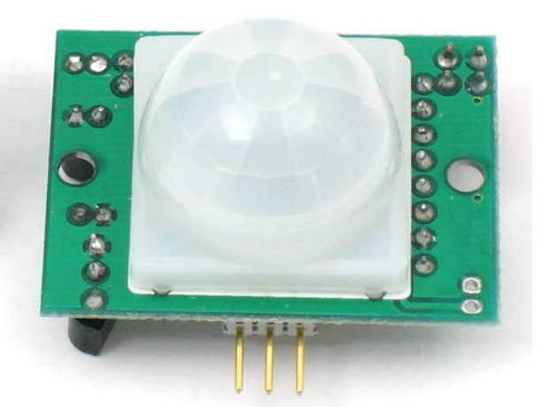
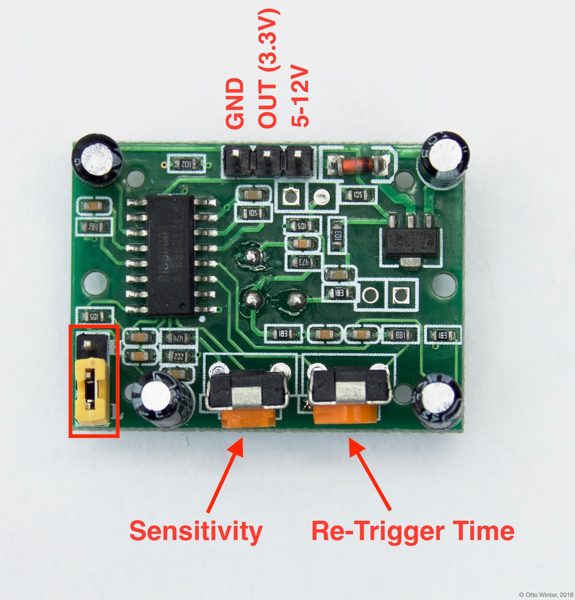
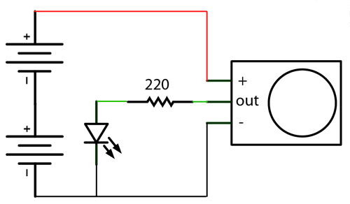
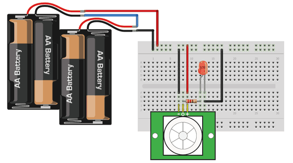
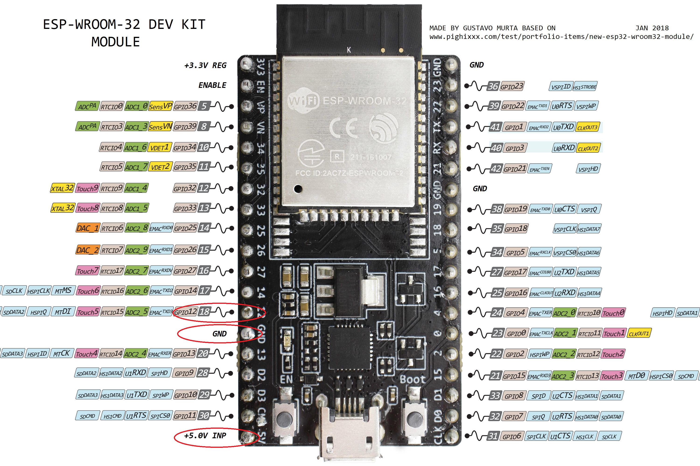

# 红外人体传感器

## 基础知识

PIR(Passive Infrared Sensors)



PIR测量前端的红外光，如果感知到一个突然的变化，输出高电平。

- 不仅仅对人体有反应，对任何发射红外光的物体都有反应
- 对红外光的变化有反应，而不是对红外光的强度有反应

## 硬件连接与设置



- 电源与输出

    1. 尽量避免使用3.3v电源作为输入
    2. 输出是3.3v，可以直接连接ESP硬件的GPIO口

- 跳线

    + H：如果持续触发，输出保持高电平
    + L：如果持续触发，输出为高低电平间隔的脉冲

- 可调电阻

    + 敏感度

        顺时针增加敏感度

    + 被触发后，输出保持的时间

        * 逆时针到底，大概为2.5秒
        * 顺时针到底，大概为250秒
        * 中间位置，大概为120秒

- 测试电路

    
    

## ESPHome配置

- 连接

    

- 配置

    ```yaml
    binary_sensor:
      - platform: gpio
        pin: GPIO12
        name: "PIR Sensor"
        device_class: motion
    ```

## 自动化

- *灯应该持续亮多长时间再熄灭？*
- *这个时间是从传感器被触发开始算，还是从传感器停止高电平输出开始算？*
- *如果灯快灭的时候，传感器又被触发，怎样实现灯的熄灭时间往后顺延？*

使用Blueprint `Motion-activated Light`