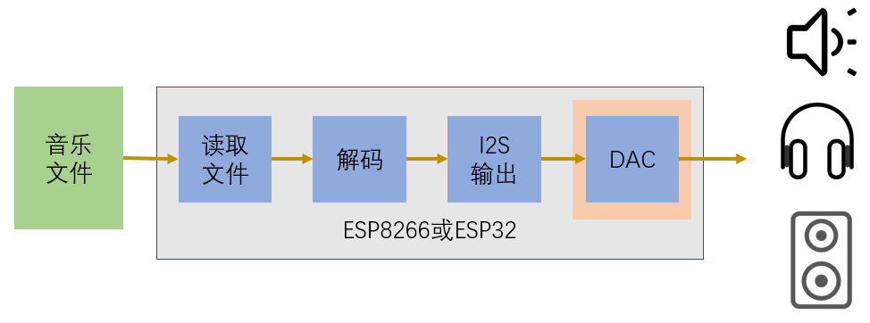
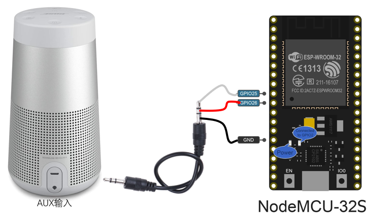

# ESP声音播放器

## 原理与硬件连接



*你也可以选择不使用ESP芯片上带的DAC功能，另外使用一个带I2S和DAC功能的模块*

参考项目：[https://github.com/earlephilhower/ESP8266Audio](https://github.com/earlephilhower/ESP8266Audio)

- NodeMCU 32s物理连接

    

## 配置ESPHome

1. 将程序[esp_audio.h](programs/esp_audio.h)放置在EspHome的配置目录中

2. 在配置yaml文件中增加以下配置

    ```yaml
    esphome:
      ……
      includes:
        - esp_audio.h
      libraries:
        - "ESP8266Audio"
      platformio_options:
        lib_ldf_mode: deep

    binary_sensor:
      - platform: custom
        lambda: |-
          auto c = new ESPAudioComponent();
          App.register_component(c);
          return {c};

        binary_sensors:
          name: "ESPAudioPlaying"
    ```

## 接入HomeAssistant

- 实体`binary_sensor.ESPAudioPlaying`

    状态表示ESPAudio是否正在播放

- 服务`esphome.xxxx_play_media`

    参数：`url`

    播放指定位置的音频媒体文件（当前仅支持http协议访问的、mp3格式的音频文件）

## 构建HomeAssistant中的媒体播发器

```yaml
# configuration.yaml配置样例
media_player:
  - platform: universal
    name: DIY-esp-audio
    state_template: >
            
              idle
            
              playing
            
              off
            
    commands:
      play_media:
        service: esphome.xxx_play_media
        data:
          url: "{{ media_content_id }}"
```

## 有待改进的内容

1. 仅支持media_play，还不支持media_stop服务
2. 仅支持http协议，还不支持HTTPS协议
3. 仅支持mp3格式，还不支持其它格式的音频文件
4. 仅支持ESP32，还不支持EPS8266
5. 存在一定的噪音，需要使用I2S/DAC功能模块

