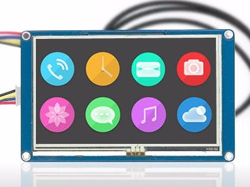
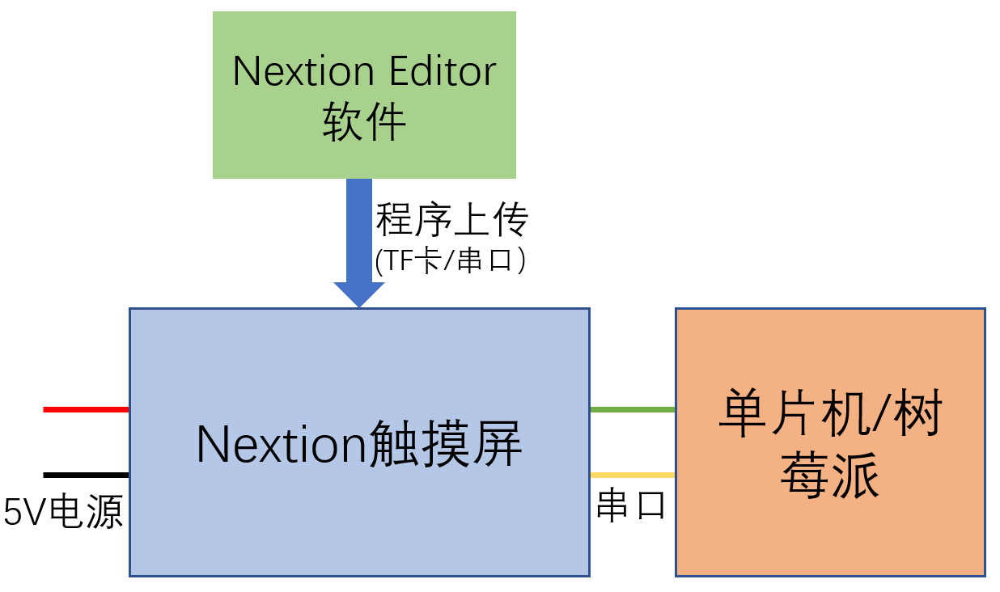

# Nextion触摸屏(1)

## 硬件



硬件型号：[https://nextion.tech/datasheets/](https://nextion.tech/datasheets/)

## 基本逻辑过程



## [设计图形界面](https://nextion.tech/editor_guide/)

Nextion Editor软件下载：[https://nextion.tech/nextion-editor/](https://nextion.tech/nextion-editor/)

基本概念
- 选择硬件型号
- 屏幕方向
- 图片
- 字体
- 页面（Page）
- 组件（Components）
    + 属性

        绿色的属性可以在运行时通过程序修改

    + vscope

        如果程序会对组件进行动态修改，建议设置成`global`

- 事件
- debug

## [指令](https://nextion.tech/instruction-set/)

指令来源

- `Program.s`：是硬件加电后执行的指令

    ```
    baud=115200
    bkcmd=0
    ```

- 通过串口输入
    + 串口输入的指令以ASCII编码，结尾是`0xFF FF FF`
    + 串口不能输入复合指令，比如`if-then-else`、`while`等

- 在component事件中定义指令

    + 当page 0（启动页面）加载完成后
    
        ```
        delay=3000
        page 1
        ```

    + 按钮`bt0`被松开时

        ```
        if(bt0.val==1)
        {
          xstr 180,280,120,40,0,BLACK,WHITE,1,1,3,"开灯..."
          delay=2000
          fill 180,280,120,40,WHITE
        }
        else
        {
          xstr 180,280,120,40,0,BLACK,WHITE,1,1,3,"关灯..."
          delay=2000
          fill 180,280,120,40,WHITE
        }
        ```

## 程序上传

建议通过tf卡完成：

- fat32格式
- 将生成的tft文件拷贝到卡上
- tf卡插入nextion触摸屏的卡槽中，重新加电，屏幕会显示上传过程
- 拔出tf卡，重启nextion触摸屏
