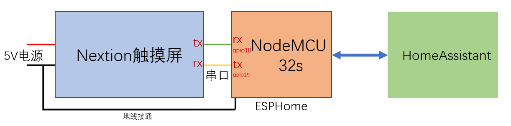
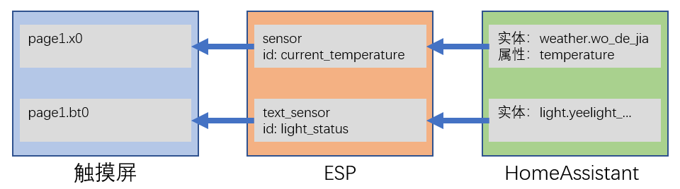

# Nextion触摸屏(2)

## 硬件连接



## nextion基础配置

```
uart:
  id: uart_2
  rx_pin: GPIO18
  tx_pin: GPIO19
  baud_rate: 115200

display:
  - platform: nextion
    id: nextion1
    uart_id: uart_2
```

## 将HA中的状态同步到触摸屏



```
sensor:
  - platform: homeassistant
    id: current_temperature
    entity_id: weather.wo_de_jia
    attribute: temperature
    on_value:
      then:
        - lambda: |-
            id(nextion1).set_component_value("page1.x0",x*10);

text_sensor:
  - platform: homeassistant
    id: light_status
    entity_id: light.yeelight_color_0x2bdd4ed
    on_value:
      then:
        - lambda: |-
            if (x=="on")
              id(nextion1).set_component_value("page1.bt0",1);
            else
              id(nextion1).set_component_value("page1.bt0",0);
```

## 将触摸屏上的内容同步到HA中


```
switch:
  - platform: nextion
    nextion_id: nextion1
    component_name: page1.bt0
    name: "Switch on Nextion"
    update_interval: 4s
```

- 以上配置每隔4秒从触摸屏上拉取一次信息；也可以将`update_interval`配置去除，在对应component的触摸事件中配置以下代码，当按钮被按动时，主动发送信息：

    ```
    printh 90
    prints "page1.bt0",0
    printh 00
    prints bt0.val,0
    printh FF FF FF
    ```

    注：此处的`print*`都是从串口输出信息到esp硬件，输出内容是ESPHome自定义的协议

- 除了[`switch`](https://www.esphome.io/components/switch/nextion.html)之外，还有[`binary_sensor`](https://www.esphome.io/components/binary_sensor/nextion.html)、[`sensor`](https://www.esphome.io/components/sensor/nextion.html)、[`text_sensor`](https://www.esphome.io/components/text_sensor/nextion.html)，可以将触摸屏上不同类型的component的值同步到HomeAssistant中。