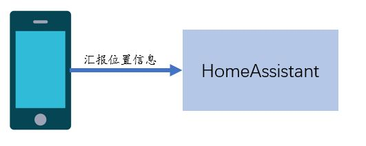
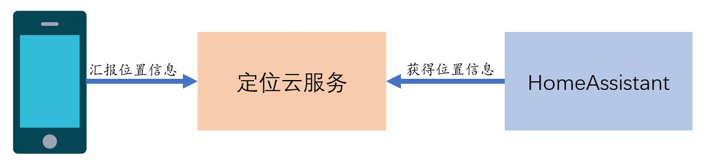
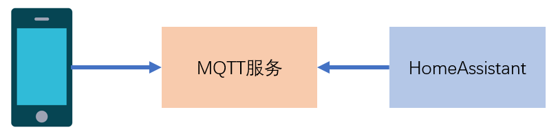

# 手机定位(1)-OwnTracks

[《HomeAssistant智能家居实战篇》视频](https://study.163.com/course/courseLearn.htm?courseId=1006189053&share=2&shareId=400000000624093#/learn/video?lessonId=1282299104&courseId=1006189053)

## 连接方式

- 直连

    

    + 需要HomeAssistant有可连接的公网地址

- 云服务连接

    

    + 下个视频介绍的`iCould`和`Life360`属于这种连接方式

## OwnTracks集成

- 当前中文界面有问题，需要在英文界面下使用
- 记录上报地址，传递给手机

    

- 可以在文件`.storage/core.config_entries`中找到上报地址的后半部分
- 如果使用`HomeAssistant Cloud`，在其中可以查看并管理上报地址

## OwnTracks APP

- OwnTracks：https://owntracks.org/

    

    适用于Android和IOS手机

- NextTracks：https://codeberg.org/nexttracks/android

    

    适用于Android手机

- 对APP授权
    + 获得定位信息的权限
    + 在后台运行的权限（开机自启动、后台自启动）

- 配置

    菜单-`Preferences`-`Connection`

- MQTT连接

    