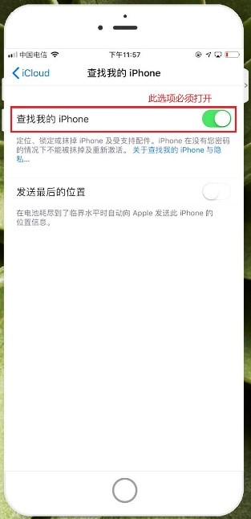
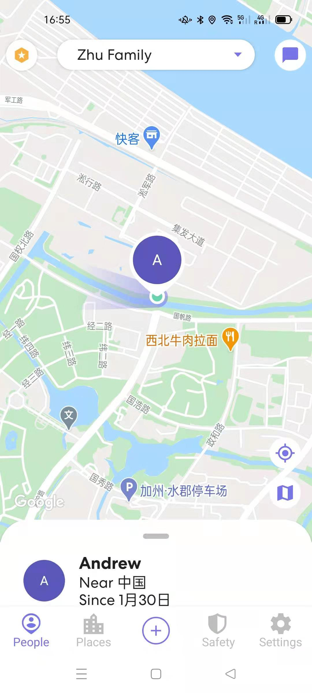

# 手机定位(2)-iCloud与Life360

[《HomeAssistant智能家居实战篇》视频](https://study.163.com/course/courseLearn.htm?courseId=1006189053&share=2&shareId=400000000624093#/learn/video?lessonId=1282287112&courseId=1006189053)

## iCloud

- 手机设置中，设置-AppleID-iCloud->“查找我的iPhone”必须要打开

    

    https://www.icloud.com/find

- 在前端集成中配置iCloud

- 四个可调用服务

    + `icloud.update`

        更新当前的位置信息

    + `icloud.play_sound`

        在设备上播放声音

    + `icloud.display_message`

        在设备上显示一条信息

    + `icloud.lost_device`

        将设备置于“丢失”模式

## Life360

https://www.life360.com/

