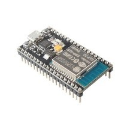
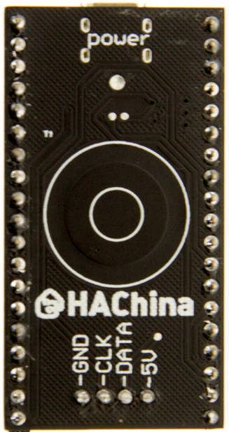
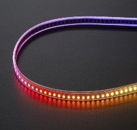
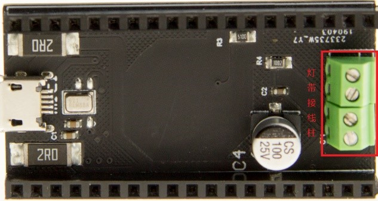
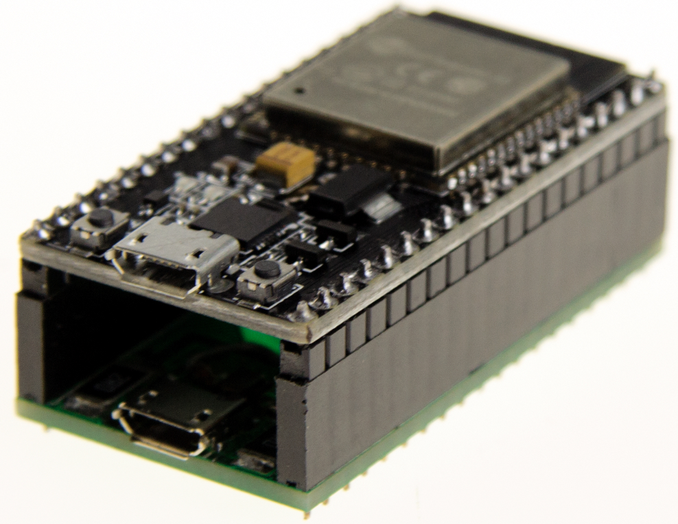
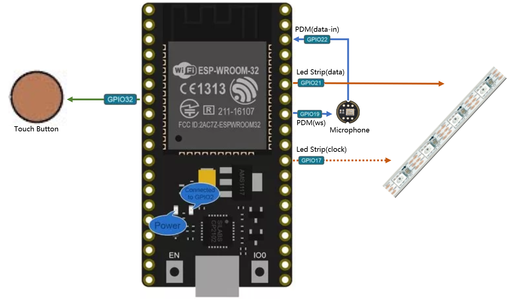

# 音乐灯带-硬件连接与基本使用

## 必要硬件

产品地址：https://www.hachina.io/audio_shield/

1. nodemcu-32s
2. 麦克风扩展板
3. led灯带（neopixel/ws2812b/apa102/…）

    　　　　

## 操作步骤

1. 硬件连接
    - 灯带接线

        

    - 对接麦克风扩展板与nodemcu-32s

        
 
    - 实际物理连接图

        
 
2. 电源供电模式

    | 电源 | 说明 |
    | :---- | :---- |
    | Nodemcu32s上的mini usb | 首先保证esp32的电力供应，剩余供给灯带（具有ubs通讯功能）|
    | 麦克风板上的mini usb | 首先给灯带供电，剩余供给esp32（无usb通讯功能）|
    | 灯带上的电源线 | 首先给灯带供电，剩余供给esp32 |

    注：

    - 可以接一个或多个电源；

    - mini usb口一般不超过2安培；

    - 在实际工程中，一般只要接通灯带上的电源线，给与充足的电力就可以了

3. 缺省程序的使用

## 参考

- 项目github地址

    https://github.com/zhujisheng/audio-reactive-led-strip
