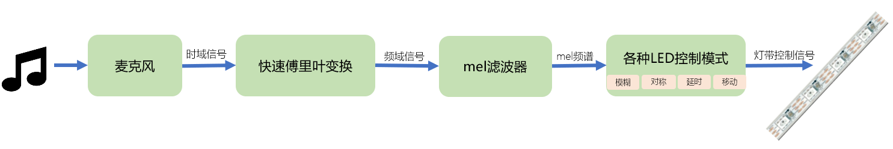

# 音乐灯带-音频处理过程与Arduino平台编译

[《HomeAssistant智能家居实战篇》视频](https://study.163.com/course/courseLearn.htm?courseId=1006189053&share=2&shareId=400000000624093#/learn/video?lessonId=1279005287&courseId=1006189053)

## 操作步骤

1. 音频处理过程

    

2. 安装`fastled`库
3. 在arduino中编译音乐灯带程序

    | 程序 | 功能 |
    | :---- | :---- |
    | `audio-reactive-led-strip.ino` | Arduino平台主程序 |
    | `includes/ExpFilter.h` | 平滑过滤器（一般用于时间维度）|
    | `includes/FFT.h` | 快速傅里叶变换、mel频谱转换 |
    | `includes/gaussian_filter1d.h` | 一维高斯模糊（一般用于空间维度） |
    | `includes/VisualEffect.h` | 灯带虚拟效果的实现 |

## 参考

-  Arduino的FastLED库

    http://fastled.io/

- 音乐灯带的github地址

    https://github.com/zhujisheng/audio-reactive-led-strip

