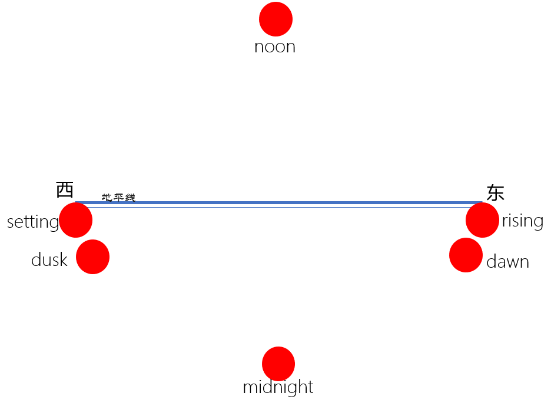
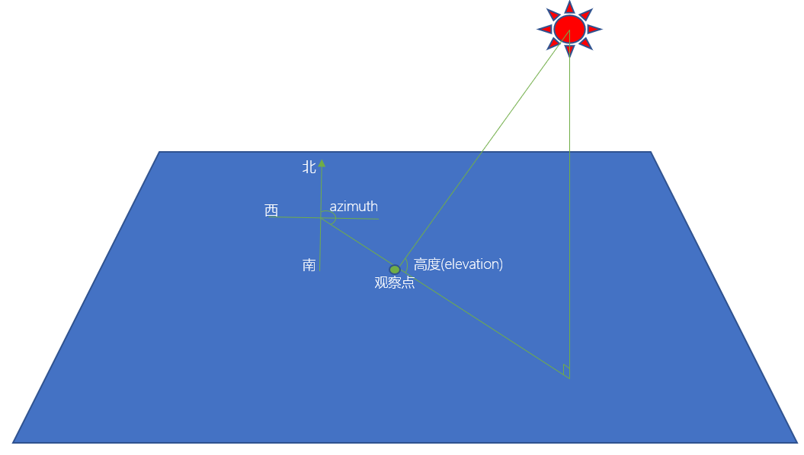
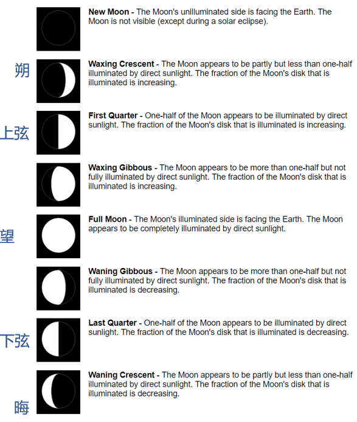
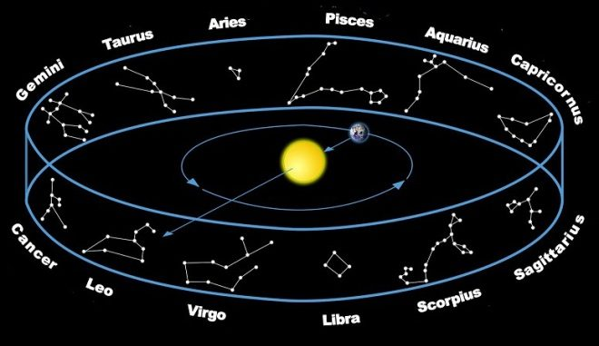

# 天文-太阳、月亮与星座

## [太阳(sun)](https://www.home-assistant.io/integrations/sun/)详解

- 配置
    - 配置`sun:`包含在配置[`default_config:`](https://www.home-assistant.io/integrations/default_config/)中

    - 如果没有配置`default_config:`，可以在`configuration.yaml`中直接配置

        ```yaml
        sun:
        ```

- 实体`sun.sun`

    + 状态
        * `above_horizon`：地平线上
        * `below_horizon`：地平线下
    + 属性：`next_xxxx`

        

    + 属性：角度
        * `elevation`
        * `azimuth`

        

## [四季](https://www.home-assistant.io/integrations/season)、[月亮](https://www.home-assistant.io/integrations/moon)、[星座](https://www.home-assistant.io/integrations/zodiac)

```yaml
sensor:
  - platform: season
  - platform: moon

zodiac:
```

- 月相

    

- 十二星座

    
