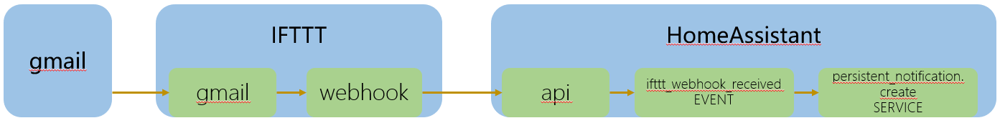

# 云端的自动化IFTTT(2)

## 操作步骤

1. 配置HA中由IFTTT触发的自动化规则
2. 配置HA中IFTTT事件的接收API
3. 配置IFTTT规则：收到邮件，触发webhook
4. 测试演示

## 参考
- 样例逻辑驱动示意

  
 
- IFTTT网站

  [https://ifttt.com/](https://ifttt.com/)

- HA中集成IFTTT配置说明

    [https://www.home-assistant.io/integrations/ifttt](https://www.home-assistant.io/integrations/ifttt)

- HA中自动化配置

  ```yaml
  - trigger:
      platform: event
      event_type: ifttt_webhook_received
      event_data:
        action: email_arrived
    action:
      service: persistent_notification.create
      data_template:
        title: 收到新邮件
        message: >
          一封来自{{ trigger.event.data.from }}的邮件，邮件主题：{{ trigger.event.data.subject }}
  ```

- IFTTT中webhook发送的json数据

`{ "action":"email_arrived", "from": "{{FromName}}", "subject": "{{Subject}}"}`
