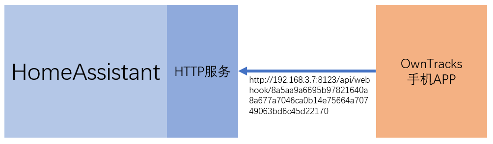

# HomeAssistant Cloud

## 收费政策

- 第一个月免费
- 第二个月开始：$5/月

## 申请与登录

## TTS服务

服务名：`tts.cloud_say`

服务数据：
```yaml
entity_id: all
message: 积木构建智慧空间
options:
  gender: female
language: zh-CN
```

## Webhooks管理

*Webhook：HomeAssistant的组件程序，在对外的HTTP服务上提供的可访问点，外部的程序可以通过对它的访问，主动的向组件程序传递信息。*



[HomeAssistant Cloud官方文档](https://www.nabucasa.com/config/)