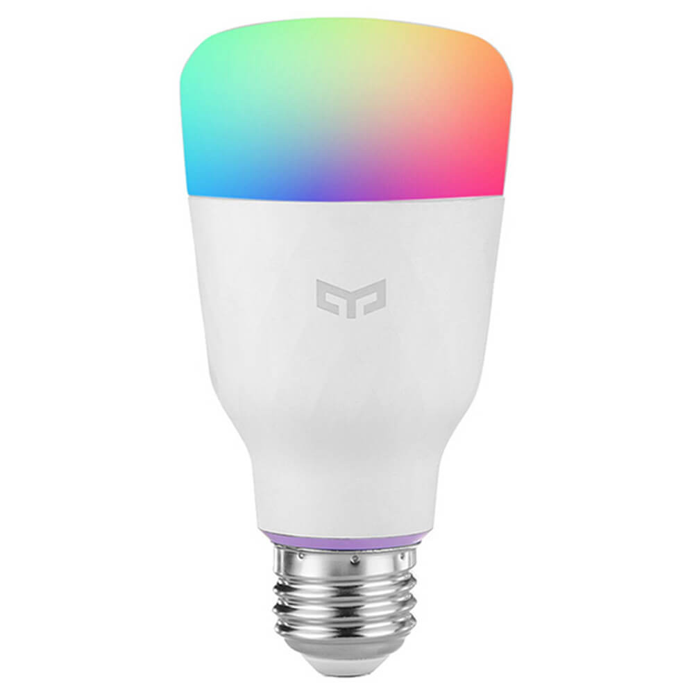

# YeeLight智能灯



## Yeelight App


- 添加设备
- 打开局域网控制

## 在HomeAssistant中配置[yeelight](https://www.home-assistant.io/integrations/yeelight/)

- 一般直接在前端`配置`/`集成`菜单中添加即可
- 可以在`configuration.yaml`中进行复杂一下的配置

    ```yaml
    # Example configuration.yaml entry
    yeelight:
      devices:
        192.168.1.25:
          name: Living Room
          transition: 1000
          use_music_mode: true
          save_on_change: true
      custom_effects:
        - name: 'Fire Flicker'
          flow_params:
            count: 0
            transitions:
              - TemperatureTransition: [1900, 1000, 80]
              - TemperatureTransition: [1900, 2000, 60]
              - SleepTransition:       [1000]
    ```

- 除了`light`域的服务外，还有一些`yeelight`域的服务可供调用

## 支持的型号

[https://www.home-assistant.io/integrations/yeelight/#supported-models](https://www.home-assistant.io/integrations/yeelight/#supported-models)

