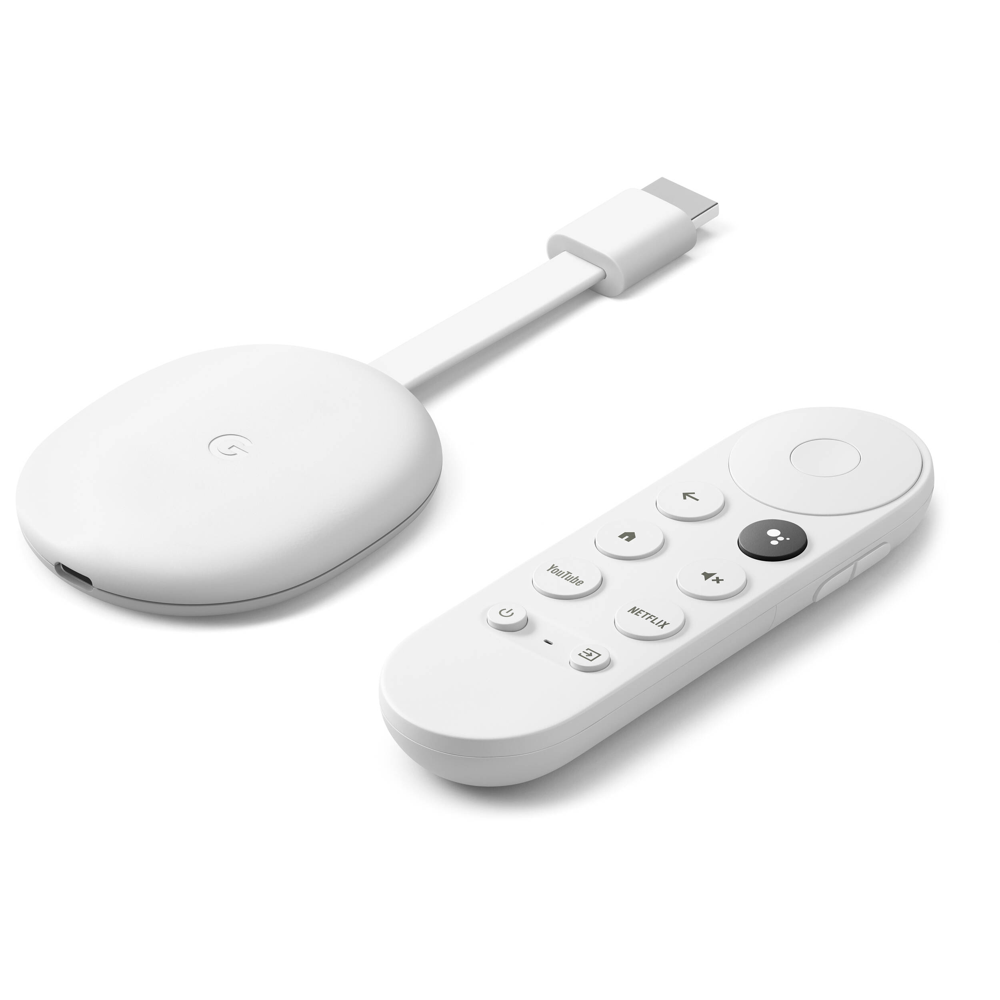
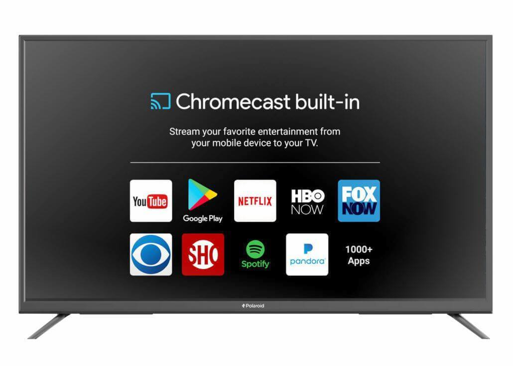
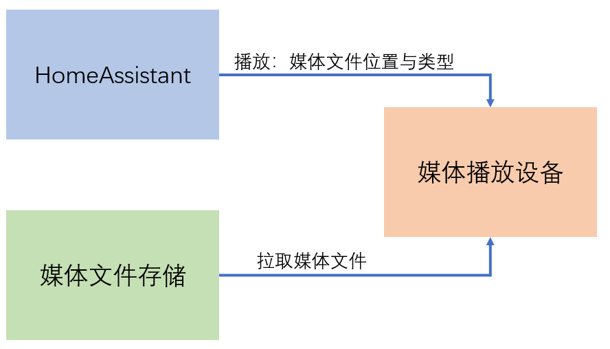

# Chromecast



## 接入HomeAssistant

配置-集成菜单中添加集成`google cast`

## 媒体播放器的功能区别

- Chromecast
  + 开启/关闭
  + 音量控制
  + 播放/暂停/跳到指定位置播放
  + 播放各种媒体（音频/视频/图片）
- PulseAudio
  + 音量控制
  + 停止播放
  + 播放音频
- 小米TV
  + 关闭/开启？
  + 音量控制

## 本地播放

- 常规media_player.play_media服务

  ```yaml
  entity_id: media_player.chromecast
  media_content_type: "image/jpeg"
  media_content_id: "http://via.placeholder.com/1024x600.jpg/0B6B94/FFFFFF/?text=Hello, Home Assistant!"
  ```

  

- 媒体播放器几乎都不支持直接播放HA服务器上的本地文件
    + 因为媒体播放设备无法访问到这些文件
    + PulseAudio是一个例外，因为它也在HA服务器上以docker形式运行，能访问本地的文件

- 将媒体文件放置在`/config/www/`目录是一种选择
  + 这个目录的访问不需要身份认证

- media_source模式

  ```yaml
  entity_id: "media_player.chromecast"
  media_content_id: "media-source://media_source/local/Canon.mp3"
  media_content_type: "audio"
  ```

  + 需要身份认证后才能从网络访问
  + 并不是所有的媒体播放器都支持这种模式

## Lovelace界面投射

*注：要实现Lovelace界面投射，HomeAssistant必须配置以`https://`开头的`external_url`，并且https服务中使用的网站证书必须是有效的*

服务：`cast.show_lovelace_view`

参数：

```yaml
entity_id: media_player.chromecast
dashboard_path: lovelace
view_path: downstairs
```
