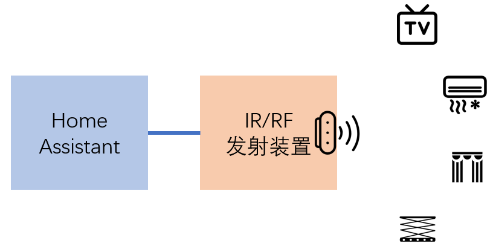
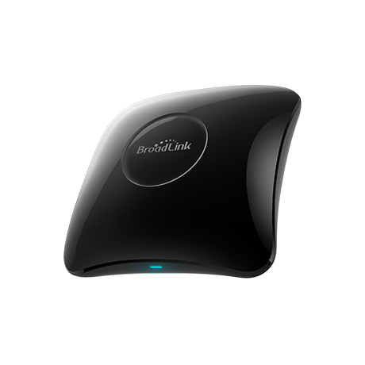
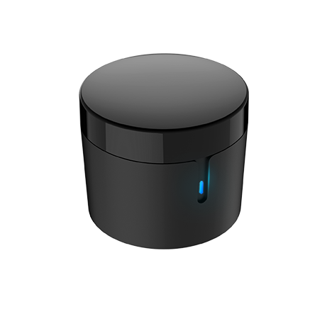

# 红外与射频遥控-博联RM系列产品

## 博联RM Pro与RM Mini

 

*RM Pro(左)带有红外与射频功能，RM Mini(右)仅有红外功能*

## 接入HomeAssistant

[Broadlink集成](https://www.home-assistant.io/integrations/broadlink/)

## 遥控指令

- 学习遥控指令

  服务：`remote.learn_command`

  + `entity_id`：遥控装置实体名
  + `device`：被控设备名
  + `command`：控制指令名称
  + `command_type`：`ir`(红外，缺省值)或`rf`(射频)
  + `alternative`：是否切换式指令

  指令保存：`/config/.storage/broadlink_remote_xxxxxxxxxxxx_codes`

  *相同操作按钮，如果学习多次，获得的编码不一定是一样的*

- 发射遥控指令

  服务：`remote.send_command`

  + `entity_id`：遥控装置实体名
  + `device`：被控设备名
  + `command`：控制指令名称，或者base64码(格式`b64:JgAcAB0dHB44HhweGx4cHR06HB0cHhwdHB8bHhwADQUAAAAAAAAAAAAAAAA=`)
  + `num_repeats`：重复发射多少次
  + `delay_secs`：发射间隔

- 删除遥控指令

  服务：`remote.delete_command`

  + `entity_id`：遥控装置实体名
  + `device`：被控设备名
  + `command`：控制指令名称

**红外无反馈**