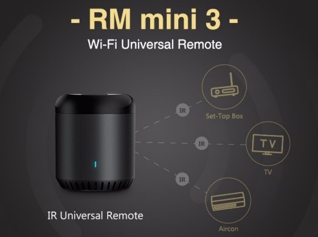

# 红外遥控-博联RM系列产品

## 硬件准备

- 博联RM系列产品（任选一）

   

## 操作步骤

1. 接入博联RM红外转发设备
2. 学习红外码
3. 配置红外码开关设备
4. 脚本调用红外发送服务

## 参考

- 博联官网

  [http://www.broadlink.com.cn/](http://www.broadlink.com.cn/)

- 博联RM Switch组件

  [https://www.home-assistant.io/integrations/broadlink](https://www.home-assistant.io/integrations/broadlink)

- 视频中演示的配置样例

  ```yaml
  switch:
    - platform: broadlink
      host: 192.168.31.177
      mac: '34:EA:34:40:79:3A'
      switches:
        tv_power:
          friendly_name: "电视开关"
          command_on: 'xxxxxxxxxxxxxxxx'
          command_off: 'xxxxxxxxxxxxxxxx'
  ```

- 视频中演示的脚本样例

  ```yaml
  tv_input_select:
    alias: 切换电视输入源
    sequence:
      - service: switch.broadlink_send_packet_192_168_31_177
        data:
          packet:
            - "xxxxxxxxxxxxxxxxxxx"
  ```