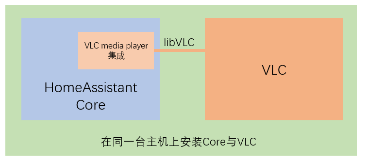
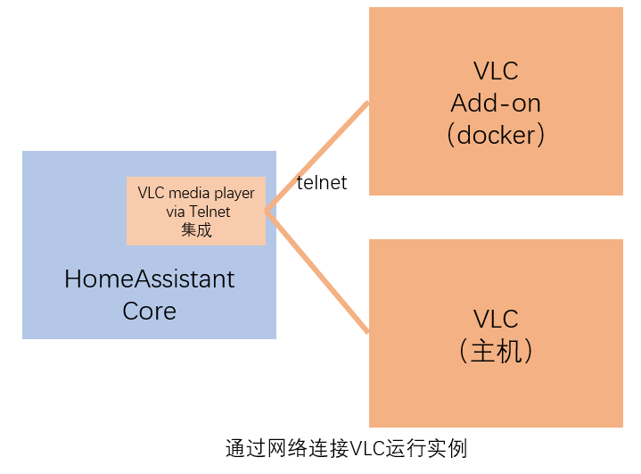

# VLC媒体播放器

- 免费
- 开源
- 支持多操作系统

## HomeAssistant中的VLC集成

- [`VLC media player`](https://www.home-assistant.io/integrations/vlc/)

    + 本机上需要安装VLC
    + 调用`libVLC`接口，实现媒体播放
    + 仅适用于直接安装HomeAssistant Core的模式

    

- [`VLC media player via Telnet`](https://www.home-assistant.io/integrations/vlc_telnet/)

    + 通过telnet协议控制其它主机上的VLC播放器
    + 需要安装VLC Add-on或者在其它机器上安装VLC

    

## 安装与使用

- VLC的安装与配置：`Add-on: VLC`
- `VLC media player via Telnet`集成的配置

## 常见问题

- 如何在`Add-on: VLC`中选择不同的音频输出设备？
- 如何手工配置连接到`Add-on: VLC`的`VLC Telnet`集成？
- 如何连接到其它主机上安装的VLC实例？

    Windows下命令行样例：

    `"C:\Program Files\VideoLAN\VLC\vlc.exe" -I telnet --telnet-port=4212 --telnet-password=admin`
