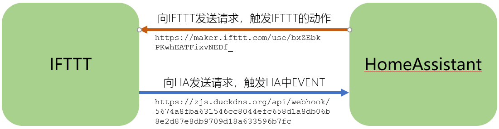

# 云端的自动化IFTTT(1)

# 操作步骤

1. IFTTT基本使用

    样例：如果gmail收到邮件，就切换YeeLight智能灯开关状态

2. 在HA中执行脚本，触发IFTTT切换YeeLight智能灯开关状态

    - 配置IFTTT规则（THIS=`webhook`，THAT=`YeeLight`）
    - 配置HA中脚本
    - 执行演示

## 参考
- IFTTT网站

    [https://ifttt.com/](https://ifttt.com/)

- IFTTT与HomeAssistant的集成

    

- HA中集成IFTTT配置说明

    [https://www.home-assistant.io/integrations/ifttt](https://www.home-assistant.io/integrations/ifttt)

- 样例：在HA中执行脚本，触发IFTTT切换YeeLight智能灯开关状态

    ```yaml
    # example_10_2_1.yaml
    ifttt:
      key: deZzryxvEslHpFoL_gsUsm
    script:
      button_press:
        alias: 通过IFTTT开关灯
        sequence:
          - service: ifttt.trigger
            data:
              event: ButtonPressed
    ```
