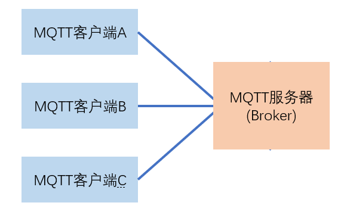
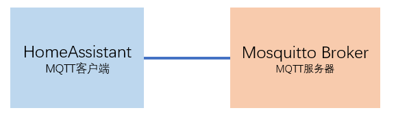
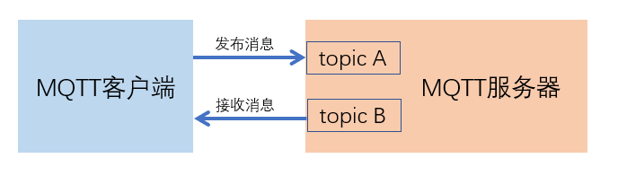

# MQTT服务配置与基本通讯模型

## 安装与连接

- 安装、启动Add-on：Mosquitto broker
- 将HomeAssistant连接到Mosquitto broker

## MQTT通讯模型

- 发布消息
- 接收消息
- 主题（topic）
- 订阅消息（subscribe）

## 发送和接收消息实验

- 菜单：集成-MQTT-配置

- 在Add-on:SSH&Web Terminal中使用mosquitto客户端命令

    `mosquitto_pub -t /aaa/bbb -m "message from mosquitto_pub" -u pi -P hachina -h 192.168.3.7`

    `mosquitto_sub -t "#" -v -u pi -P hachina -h 192.168.3.7`

