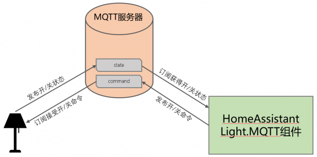

# MQTT协议智能灯

[《HomeAssistant智能家居实战篇》视频](https://study.163.com/course/courseLearn.htm?courseId=1006189053&share=2&shareId=400000000624093#/learn/video?lessonId=1282336361&courseId=1006189053)

## 智能灯通讯模型



- 被控端：智能灯

    - 发布消息：灯的状态（位置：状态主题）
    - 订阅消息：开/关命令（位置：命令主题）

- 控制端：HomeAssistant

    - 发布消息：开/关命令（位置：命令主题）
    - 订阅消息：灯的状态（位置：状态主题）

## 在HomeAssistant中配置`light.mqtt`

```yaml
mqtt:
  light:
    - schema: json
      command_topic: "bedroom/light1/comm"
      state_topic: "bedroom/light1/stat"
```

## 在ESPHome中实现智能灯

```yaml
mqtt:
  broker: 192.168.3.7
  username: pi
  password: hachina

output:
  - platform: gpio
    pin: GPIO2
    id: my_led

light:
  - platform: binary
    name: "LED On NodeMCU Board"
    output: my_led
    state_topic: bedroom/light1/stat
    command_topic: bedroom/light1/comm
    discovery: false
```

## 增加亮度控制

```yaml
mqtt:
  light:
    - schema: json
      command_topic: "bedroom/light1/comm"
      state_topic: "bedroom/light1/stat"
      brightness: true
```

```yaml
output:
  # esp32使用ledc，esp8266使用esp8266_pwm
  - platform: ledc
# - platform: esp8266_pwm
    pin: GPIO2
    id: my_led

light:
  - platform: monochromatic
    name: "LED On NodeMCU Board"
    output: my_led
    state_topic: bedroom/light1/stat
    command_topic: bedroom/light1/comm
    discovery: false
```

