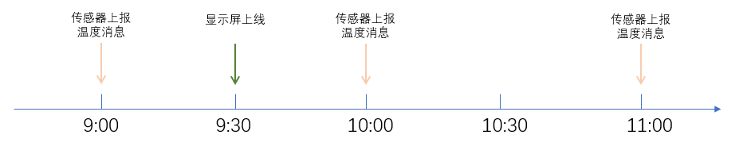

# MQTT概念-Qos,Retain,Last_will,Discovery…

## retain

MQTT服务器在收到某个主题上的非retain新消息后，仅转发给**当前连接的**，并订阅此主题的客户端。

retain消息：发送给**未来**连接的、订阅此主题的客户端

## will（遗嘱）

客户端告诉服务器：“当我到你的连接断开的时候，请在xxx主题位置发布yyy消息”

## 应用：availability（可用性）

- "online"和"offline"消息都是retain属性的消息
- "offline"消息通过will机制发送

## 应用：discovery（自动发现）

## QoS

- 0：信息仅被传输一次，对于信息是否被收到不做任何确认。
- 1：信息可能被传输若干次，只有当信息收取者确认收到后才停止传输。
- 2：通过额外的4次握手过程，保证信息仅被传输一次，并且接收者收到了信息。
