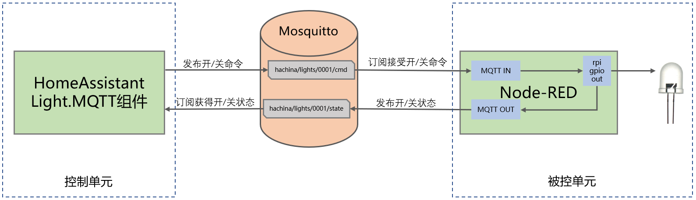

# 基于NodeRED讲解MQTT(2)-主题格式、状态反馈、调试…

[《HomeAssistant智能家居实战篇》视频](https://study.163.com/course/courseLearn.htm?courseId=1006189053&share=2&shareId=400000000624093#/learn/video?lessonId=1278315840&courseId=1006189053)

*注：本视频课程中MQTT服务器安装在PiOS下，你也可以按照前面视频课程直接安装add-on:Mosquitto，并通过前端配置集成接入HomeAssistant*

## 操作步骤
1. 主题格式
2. 在HA中配置一盏有状态反馈的MQTT智能灯
3. 使用Node-RED作为MQTT智能灯执行机构
4. 在Node-RED中手工控制灯
5. 调试：接收所有消息
6. 使用test.mosquitto.org

## 参考

- MQTT的主题格式

    `A/B/C/D/E`

    例如：`sensors/COMPUTER_NAME/temperature/HARDDRIVE_NAME`

    只要在发送和订阅端持一致即可；具体的深度与位置完全自由

- 连接结构图

    

- Mosquitto在不同操作系统的安装

    http://www.mosquitto.org/download/
