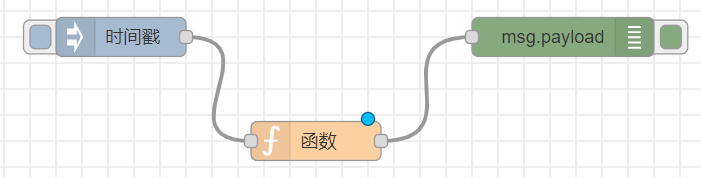

# 创建第一个流程(安装与基础使用)


- 几乎不用写代码的编程工具
- 整合各种硬件操作、API、云服务

## 启动add-on:Node-RED

- 配置

    + `credential_secret`

        任意字符串，Node-RED用它加密需要存储的机密信息。升级/重装时不要更换。

    + `ssl`与`require_ssl`

        如果不使用网站数字证书的话，配置为`false`

- 进入Node-RED界面的三种方法
    + `OPEN WEB UI`
    + `Show in sidebar`
    + 不通过HomeAssistant前端，直接在浏览器中打开

## 创建第一个流程



- `function`节点

    ```js
    // 从msg.payload创建一个Date对象
    var date = new Date(msg.payload);
    // 将msg.payload设置成字符串表达的时间
    msg.payload = date.toString();
    // 返回msg作为节点输出
    return msg;
    ```

## 基本概念

- 节点（Node）

    一个节点就是一个功能处理单元，不同的节点完成不同的功能

- 流程（Flow）

    连接的节点构成流程

- 消息（Message）

    节点之间通过连接传递消息；消息驱动流程中各个节点的运行

- Node-RED是基于JavaScript语言的

    + 如果你要熟练使用nodered，你需要了解一些javascript的基本语法
    + 如果你要成为nodered的专家，你需要熟练掌握javascript语言
    + 参考：[https://www.liaoxuefeng.com/wiki/1022910821149312](https://www.liaoxuefeng.com/wiki/1022910821149312)
