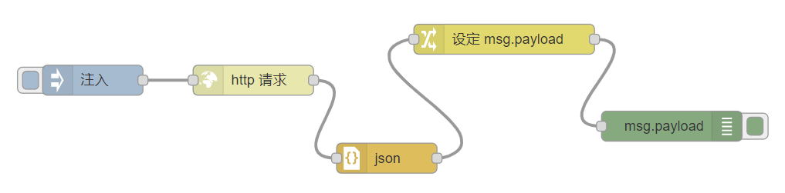
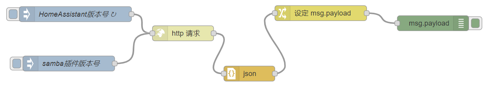

# 创建第二个流程(进一步理解)

## 流程实现

功能：从网络获得HomeAssistant的最新版本号

最新版本号URL：[https://updater.home-assistant.io/](https://updater.home-assistant.io/)

- `http request`节点

    发送http请求，获得返回内容

- `json`节点

    解析json字符串

- `change`节点

    对输出消息进行设置

## 流程修订

- 周期性运行流程

- 将url从`inject`节点传入

## 增加流程分支：获得最新的addon:samba的版本号

- `inject`节点中，`msg.url`设置为`https://raw.githubusercontent.com/home-assistant/addons/master/samba/config.json` 

- 如果是在网络访问受限的中国大陆：

    `inject`节点中，`msg.url`设置为`https://185.199.108.133/home-assistant/addons/master/samba/config.json`

    另外增加`msg.headers`为`{"host":"raw.githubusercontent.com"}`
