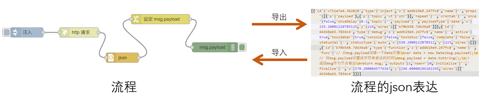

# 最佳实践技巧

## 流程的导入和导出



上个视频中制作的流程：
```json
[{"id":"6a52d3aa.e431fc","type":"inject","z":"addb19e9.247fc8","name":"HomeAssistant版本号","props":[{"p":"url","v":"https://updater.home-assistant.io/","vt":"str"}],"repeat":"3600","crontab":"","once":false,"onceDelay":0.1,"topic":"","x":187.00001525878906,"y":245.00001430511475,"wires":[["152591c.38aa26e"]]},{"id":"152591c.38aa26e","type":"http request","z":"addb19e9.247fc8","name":"","method":"GET","ret":"txt","paytoqs":"query","url":"","tls":"","persist":false,"proxy":"","authType":"","x":398.00001525878906,"y":283,"wires":[["b9b9b3fc.f5226"]]},{"id":"186966b5.680109","type":"debug","z":"addb19e9.247fc8","name":"","active":true,"tosidebar":true,"console":false,"tostatus":false,"complete":"false","statusVal":"","statusType":"auto","x":888.0000152587891,"y":263,"wires":[]},{"id":"b9b9b3fc.f5226","type":"json","z":"addb19e9.247fc8","name":"","property":"payload","action":"","pretty":false,"x":528.0000152587891,"y":363,"wires":[["60a40d15.6d4144"]]},{"id":"60a40d15.6d4144","type":"change","z":"addb19e9.247fc8","name":"","rules":[{"t":"set","p":"payload","pt":"msg","to":"payload.version","tot":"msg"}],"action":"","property":"","from":"","to":"","reg":false,"x":668.0000152587891,"y":243,"wires":[["186966b5.680109"]]},{"id":"b9c25833.c4d6f8","type":"inject","z":"addb19e9.247fc8","name":"samba插件版本号","props":[{"p":"url","v":"https://199.232.96.133/home-assistant/addons/master/samba/config.json","vt":"str"},{"p":"headers","v":"{\"host\":\"raw.githubusercontent.com\"}","vt":"json"}],"repeat":"","crontab":"","once":false,"onceDelay":0.1,"topic":"","x":174.00000762939453,"y":342.99999237060547,"wires":[["152591c.38aa26e"]]}]
```

作用：
- 备份与恢复
- 流程分享

## 备注信息

- 信息备注的位置：
    + 流程页面
    + 节点
    + 节点的输入输出
    + `comment`节点

## 子流程（subflow）

- 子流程生成后，可以在多个流程中重复使用
- 子流程可以让复杂流程的显示更清晰

## 本地库（library）

- 将流程以库的形式保存在Node-RED服务器上
- `function`、`template`节点的程序保存
- 所有保存的库，位于`/config/node-red/lib/`目录中
- 不需要时，直接删除文件即可

## 键盘快捷方式

- `CTRL+c`：复制
- `CTRL+v`：黏贴
- `CTRL+z`：撤销操作（Undo）
- `CTRL+y`：重复操作（Redo）


