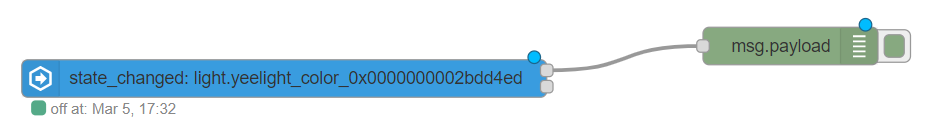
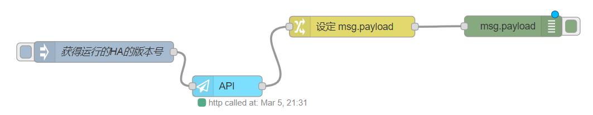

# 节点管理与HomeAssistant联动

*本课程的一些操作，涉及到HomeAssistant的API调用。大家对此不了解的话，可以参考《操作进阶篇》中的[《HTTP服务-www目录与API调用》](../06.%E6%93%8D%E4%BD%9C%E8%BF%9B%E9%98%B6%E7%AF%87/2.HTTP%E6%9C%8D%E5%8A%A1-WWW%E7%9B%AE%E5%BD%95%E4%B8%8EAPI%E8%B0%83%E7%94%A8.md)*

## Node-RED中的节点与管理

HomeAssistant节点包：`node-red-contrib-home-assistant-websocket`

*注意：Node-RED中可安装的节点包管理比较松散，存在大量过时与不可用的节点包*

## HomeAssistant联动

- 一个简单流程样例：接收事件

    

- 配置节点（Configuration Node）

    配置节点是一种特殊类型的节点，在配置节点中会保存可在其他节点使用的配置信息。

- 自定义组件`hass-node-red`

    [https://github.com/zachowj/hass-node-red](https://github.com/zachowj/hass-node-red)

    `webhook`和`entity`节点需要`hass-node-red`组件配合才能正常工作

## 获得当前运行的HomeAssistant Core版本号



```json
[{"id":"e92ac340.9acb7","type":"ha-api","z":"228b5da6.a7af42","name":"","server":"af5706cd.d27ec8","debugenabled":false,"protocol":"http","method":"get","path":"/api/config","data":"","dataType":"json","location":"payload","locationType":"msg","responseType":"text","x":380.456729888916,"y":271.56011867523193,"wires":[["77e85d08.426244"]]},{"id":"20709687.8c672a","type":"inject","z":"228b5da6.a7af42","name":"获得运行的HA的版本号","props":[{"p":"payload"},{"p":"topic","vt":"str"}],"repeat":"","crontab":"","once":false,"onceDelay":0.1,"topic":"","payload":"","payloadType":"date","x":203.4639434814453,"y":222.2259750366211,"wires":[["e92ac340.9acb7"]]},{"id":"1d88e7c8.f9b668","type":"debug","z":"228b5da6.a7af42","name":"","active":true,"tosidebar":true,"console":false,"tostatus":false,"complete":"payload","targetType":"msg","statusVal":"","statusType":"auto","x":789.4519729614258,"y":221.22112846374512,"wires":[]},{"id":"77e85d08.426244","type":"change","z":"228b5da6.a7af42","name":"","rules":[{"t":"set","p":"payload","pt":"msg","to":"payload.version","tot":"msg"}],"action":"","property":"","from":"","to":"","reg":false,"x":559.454345703125,"y":185.83894062042236,"wires":[["1d88e7c8.f9b668"]]},{"id":"af5706cd.d27ec8","type":"server","name":"Home Assistant","legacy":false,"addon":true,"rejectUnauthorizedCerts":true,"ha_boolean":"y|yes|true|on|home|open","connectionDelay":true,"cacheJson":true}]
```
